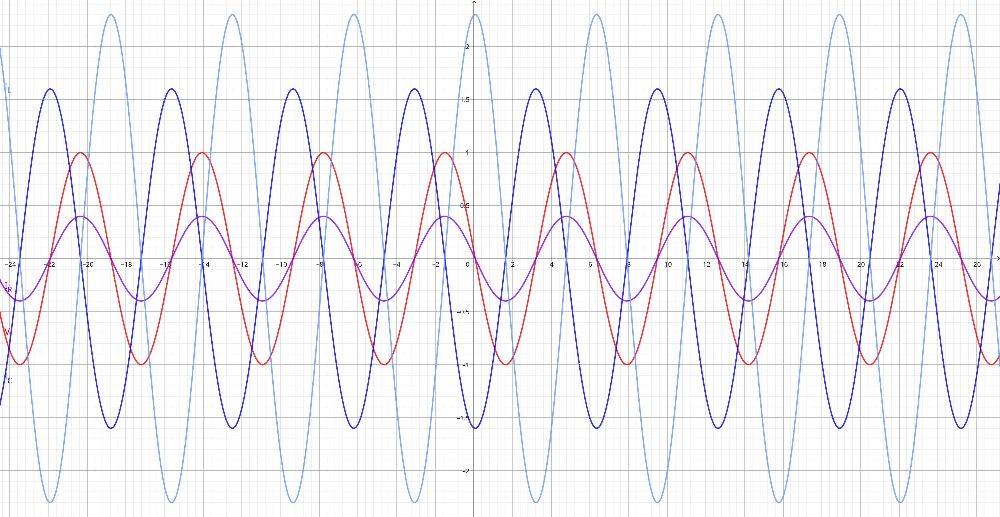
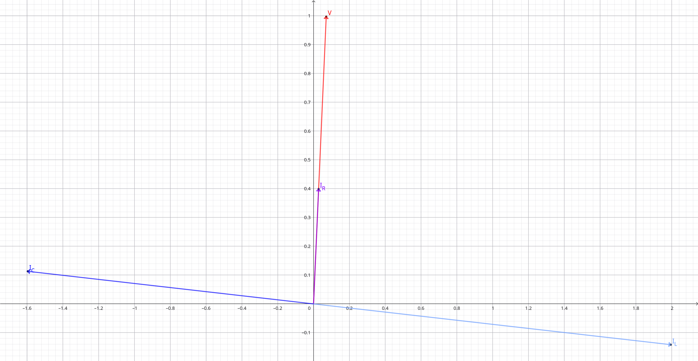

## Soluzione di una rete LTI con ingresso sinusoidale

La scorsa lezione abbiamo visto che è possibile trovare la soluzione di una
generica rete LTI con ingresso sinusoidale.

In genere $s_i$ è un numero complesso. Chiameremo $s'_i$ la parte reale e
$s''_i$ la parte immaginaria.

$$
y_h(t) = \sum_{i = 1}^n k_i e^{s_i t} = \sum_{i = 1}^n e^{s'_i t} e^{j s''_i t}
$$

:::note

$e^{j s''_i t}$ è il termine che fa oscillare $y_h(t)$ quando non è nullo.

:::

- Se $s'_i > 0$, allora $\lim_{t \to \infty} y_h(t) = \infty$. Questo non è
  accettabile perchè il sistema arriverebbe a consumare una quantità di energia
  infinita.
- Se $s'_i = 0$, il circuito oscilla con ampiezza costante. Non è realistico
  perchè c'è sempre una quantità di energia che viene dissipata sotto forma di
  calore.
- Se $s'_i < 0$, allora $\lim_{t \to \infty} y_h(t) = 0$. Ci troviamo nei casi
  smorzati visti in precedenza.

:::note

Nel caso smorzato, quando il circuito arriva a regime, rimane solo $y_p(t)$.

:::

## Collegamento di un generatore ad un bipolo

Prendo un generatore $i(t) = \opre{\tilde{i}\ e^{j \omega t}}$.

```
┌─────┐
│+    │
i(t)  B
│-    │
└─────┘
```

### Bipolo di tipo resistore ($B = R$)

$$
v(t) = R\ i(t)
  \iff \opre{\tilde{v}\ e^{j \omega t}} = \opre{R\ \tilde{i}\ e^{j \omega t}}
  \iff \tilde{v} = R \tilde{i}
$$

### Bipolo di tipo capacitore ($B = C$)

$$
i(t) = C \dv{v}{t}(t)
  \iff \opre{\tilde{i}\ e^{j \omega t}} = \opre{C \dv{\tilde{v}\ e^{j \omega t}}{t}} = \opre{C j \omega \tilde{v} e^{j \omega t}}
  \iff \tilde{i} = j \omega C \tilde{v}
  \iff \tilde{v} = \frac{\tilde{i}}{j \omega C}
$$

### Bipolo di tipo induttore ($B = L$)

$$
v(t) = L \dv{i}{t}(t)
  \iff \opre{\tilde{v}\ e^{j \omega t}} = \opre{L \dv{\tilde{i} e^{j \omega t}}{t}} = \opre{L j \omega \tilde{i} e^{j \omega t}}
  \iff \tilde{v} = j \omega L \tilde{i}
$$

## Impedenza

L'impedenza è il corrispettivo della resistenza per i circuiti a corrente
alternata. È un numero costante nel tempo e dipendente solamente dalla frequenza
di un circuito, definito come:

$$
Z = \frac{\tilde{v}}{\tilde{i}}
$$

- Per il resistore: $Z = R$;
- Per il capacitore: $Z = \frac{1}{j \omega C}$;
- Per l'induttore: $Z = j \omega L$;

In generale $Z$ è un numero complesso, quindi
$|Z| = \frac{|\tilde{v}|}{|\tilde{i}|}$ e
$\theta_Z = \theta_{\tilde{v}} - \theta_{\tilde{i}}$.

:::note

Il reciproco dell'impedenza $Y = \frac{\tilde{i}}{\tilde{v}}$ è chiamato
ammettanza.

:::

### Impedenze in serie e parallelo

Si ricavano facilmente con le leggi di Kirchhoff.

- in serie: $Z_{\text{tot}} = \sum_i Z_i$;
- in parallelo: $\frac{1}{Z_{\text{tot}}} = \sum_i \frac{1}{Z_i}$;

## Circuito RLC in parallelo con fasori

Prendo un circuito dove resistore, condensatore e induttore sono in parallelo.
La corrente in entrata ha andamento sinusoidale
$i_s(t) = \opre{\tilde{i}_s\ e^{j \omega t}}$.

```
┌───────┬────┬────┐
i_s(t)  C_1  L_1  R_1
└───────┴────┴────┘
```

Supponiamo di voler trovare $I_{R_1}(t)$. Bastano 2 equazioni (+ quelle per
trovare l'impedenza):

$$
\begin{dcases}
\tilde{i}_{R_1} = \frac{\tilde{v}_s}{R_1} \\
\tilde{i}_s = \frac{\tilde{v}_s}{Z_{\text{tot}}} \\
\end{dcases}
$$

$$
\tilde{i}_{R_1} = \frac{Z_{\text{tot}}}{\tilde{i}_s}
$$

## Comportamento dei componenti circuitali rispetto al tempo e alla fase

Rispetto al tempo: https://www.geogebra.org/calculator/nqdfrchm



Rispetto alla fase: https://www.geogebra.org/calculator/xbdrevxx


