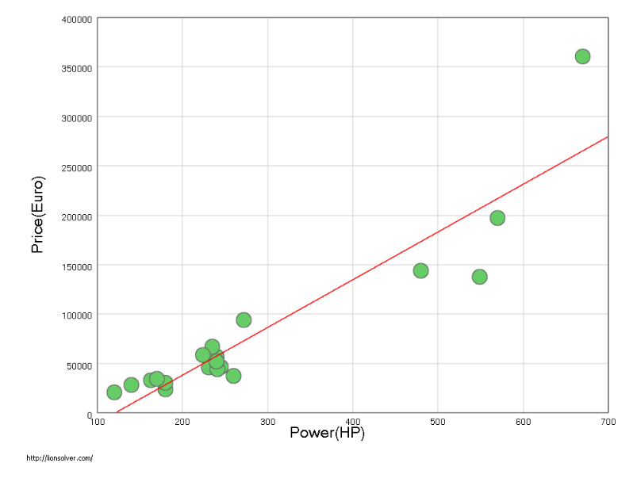

## Modelli lineari

I modelli lineari servono a generalizzare problemi in cui la relazione tra il
cambiamento di valore dell'input $\mathbf{x}$ e l'output $y$ può essere trovata
attraverso la soluzione di un sistema lineare.

Ciò li rende molto semplici sia da allenare che da capire, basta analizzare i
parametri per capire quali sono quelli che maggiormente influenzano il
risultato.

**Esempio**: si può generalizzare la relazione tra la potenza e il costo di
automobile:

### Regressione lineare

In un modello lineare, ogni componente $x_i$ di $\mathbf{x}$ è moltiplicata da
un parametro $w_i$. Possiamo generalizzare e scrivere che il risultato è dato
dal prodotto scalare tra la matrice trasposta dei parametri e il vettore input.

$$
f(\mathbf{x}) = \mathbf{w}^T \cdot \mathbf{x}
$$

:::note

Per convenzione, dato un vettore $\mathbf{v}$, sarà un vettore colonna.
$\mathbf{v}^T$ sarà un vettore riga.

:::

:::note

I parametri si denotano con $\mathbf{w}$ perchè in inglese sono chiamati
'weights'.

:::

### Tecniche di approssimazione non lineare

La prima restrizione che incontriamo usando la $f$ definita sopra è che si
assume che $f(0) = 0$.

Per risolvere il problema basta aggiungere una dimensione fittizia ad $f$ e poi
fissare la nuova componente del vettore input a 1.

Questi modelli vengono detti **affini**.

In questo caso $f$ sarà la funzione lineare e $g$ la funzione affine:

$$
g(\mathbf{x}) = f(1, \mathbf{x}) = w_0 + \mathbf{w}^T \cdot \mathbf{x}
$$

Questo è un caso particolare di modellazione di dipendenze non lineari pur
continuando ad usare l'approssimazione della retta che minimizza la somma degli
errori quadratico.

Per usare l'algebra lineare per ottimizzare **è necessario che i pesi siano
lineari, non i dati in input**. Infatti durante l'ottimizzazione la variabile da
trovare è $\mathbf{w}$, mentre $\mathbf{x}$ rimane costante.

#### Generalizzazione

In pratica i dati di input possono essere processati a piacimento per estrarre
più features.

Possiamo definire una funzione $\phi: \R^d \to \R^n$ che applica trasformazioni
arbitrarie al vettore di input (anche non lineari). Poi daremo quel risultato in
pasto al nostro modello lineare:

$$
f(\mathbf(x)) = \mathbf{w}^T \cdot \phi(\mathbf{x})
$$

### Classificazione lineare

Nel caso della classificazione possiamo usare il risultato della regressione
lineare come discriminante.

Il prodotto scalare tra 2 vettori $\mathbf{w}$ e $\mathbf{x}$ permette di
delimitare 2 iperpiani, uno dove il risultato è positivo, l'altro dove è
negativo. La frontiera tra 2 i iperpiani è data dai vettori perpendicolari a
$\mathbf{w}$.

:::note

In più dimensioni, un piano generalizza la retta e un iperpiano generalizza gli
spazi generati dalla suddivisione.

:::

### Ottimizzazione attraverso la pseudo-inversa

Come visto in precedenza, dobbiamo trovare il valore dei pesi $\mathbf{w}$ in
modo da minimizzare gli errori del modello:

$$
E(\mathbf{w}) = \sum_{i=1}^n (\mathbf{w}^T \cdot \mathbf{x}_i - y_i)^2
$$

Nel caso ideale, senza errori di misurazione sul dataset degli esempi, si
potrebbero trovare i pesi attraverso un sistema di equazioni lineari, che si
risolve invertendo la matrice dei coefficienti:

$$
\mathbf{A}\ \mathbf{x} = \mathbf{b} \iff \mathbf{x} = \mathbf{b}\ \mathbf{A}^{-1}
$$

Nella realtà, purtroppo, ci sono sempre errori di misurazione. Quindi si ottiene
un sistema non lineare dove alcune equazioni danno risultati contraddittori.
Occorre quindi approssimare la soluzione che permetta di minimizzare
$E(\mathbf{w})$ anche se difficilmente si arriverà allo $0$.

Per fare ciò possiamo usare la matrice $\mathbf{A}$, detta pseudoinversa di
$\mathbf{A}$ e definita:

$$
(\mathbf{A}^T\ \mathbf{A})^{-1}\ \mathbf{A}^T = \mathbf{A}^{*} \sim \mathbf{A}^{-1}
$$

Noi dobbiamo risolvere il sistema di equazioni
$\mathbf{w} \cdot \mathbf{x}_i = y_i$ usando tutti gli esempi, quindi otteniamo
la seguente formula:

$$
\mathbf{w} = (\mathbf{X}^T\ \mathbf{X})^{-1}\ \mathbf{X}^T\ \mathbf{y}
$$
