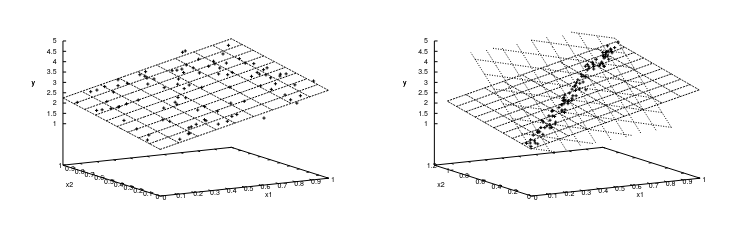
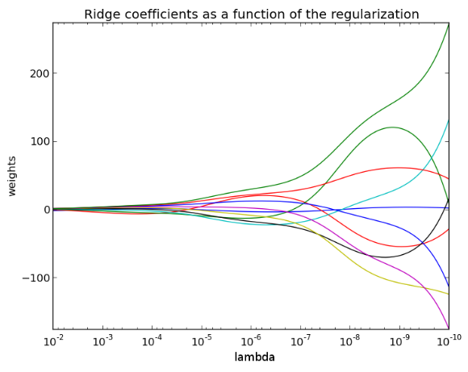
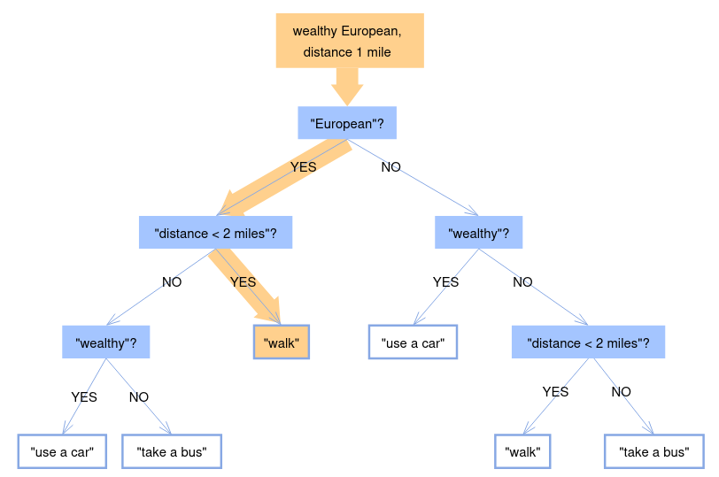

## Instabilità nei modelli lineari

Un modello è detto stabile quando piccoli errori di misura sull'input o errori
di arrotondamento sui calcoli eseguiti dal computer influenzano in maniera
negligibile il risultato.

Il primo modo per rendere un modello più stabile è quello di **ottenere dati
migliori**. Nei grafici sotto:

- il primo insieme è ben distribuito, quindi lo spostamento di alcuni punti
  (valori degli esempi nel training set) non genera variazioni nell'inclinazione
  del piano (che può rappresentare un divisore tra 2 iperpiani per la
  classificazione);
- il secondo rende il modello molto sensibile a piccoli cambiamenti di valore
  degli esempi;

Il secondo modo, quando non c'è possibilità di modificare gli esempi, è quello
di utilizzare la **ridge regression**, ovvero l'aggiunta di un **termine di
regolarizzazione** alla funzione di errore.

Quando inserisco un piccolo termine diagonale alla pseudo inversa, l'operazione
di inversione diventa molto meno sensibile ad errori di calcolo del computer:

$$
E(\mathbf{w}, y) = \sum_i (\mathbf{w}^T \cdot \mathbf{x}_i - y_i)^2 + \lambda\ \mathbf{w}^T \cdot \mathbf{w}
$$

Per minimizzare rispetto a $\mathbf{w}$ si usa la seguente espressione:

$$
\mathbf{w} = (\lambda\ \mathbf{I} + \mathbf{X}^T\ \mathbf{X})^{-1}\ \mathbf{X}^{T}\ \mathbf{y}
$$

Il valore di $\lambda$ può essere ottenuto provandone diversi sul validation set
e tenere quello che da i risultati migliori. Nell'immagine sotto si vede come un
$\lambda$ troppo grande fa perdere significato ai pesi.

:::tip

È una buona idea normalizzare i dati di input a numeri non troppo grandi o
piccoli in modo da evitare di avere errori troppo grandi (dati da grandi
variazioni di valore dei dati) o una precisione troppo bassa (data dai problemi
che hanno i computer a gestire numeri reali).

:::

## Regole decisionali

Negli anni 70, si era cercato di sviluppare sistemi di intelligenza artificiale
basati su regole, il risultato era deterministico perchè per ogni causa era
definito un effetto.

Una regola è un piccolo 'pezzo' di conoscienza, che talvolta può essere espresso
mediante linguaggio umano.

Problemi:

- le regole devono essere scritte a mano;
- quando il numero di regole cresce, è possibile introdurre regole
  contradittorie;

Regole complesse devono essere spezzate in una catena di regole più semplici
unite da un AND. In questa catena dobbiamo mettere le regole più informative
all'inizio.

Se organizzo le regole sottoforma di albero, posso creare una gerarchia senza
contraddizioni.

### Alberi di decisione

Un albero di decisione è un insieme di domande, organizzate in maniera
gerarchica, con un sottoalbero per ogni risposta che può ricevere una specifica
domanda.

La costruzione di un albero è un processo ricorsivo, basta prendere una domanda
e dividere il training set a seconda della risposta. Poi per ogni ramo ripeto il
processo passando alla prossima.

:::note

Di solito si cerca di creare domande che abbiano una risposta binaria (tipo sì o
no), in modo da limitare il numero di rami che ciascun nodo può avere.

:::

Il problema che resta è quello di determinare qual'è la domanda più informativa
da usare all'inizio.

Durante il training le domande 'finali' sono quelle dove tutte le risposte (o
una gran parte di esse) del subset cadono in un solo ramo. A quel punto non a
più senso continuare il processo e si può restituire un output all'utente.

Le domande che classificano un alto numero di esempi in un ramo rispetto agli
altri sono dette più **pure** rispetto alle altre. Le domande più informative
sono quelle che purificano maggiormente l'input.

#### Misura quantitativa della purezza

La purezza può essere misurata in 2 modi:

- **Guadagno informativo** (information gain):

  Preso un campione del set di training associato con il nodo (ovvero la
  domanda) dell'albero, per ogni elemento dell'insieme ci sarà una probabilità
  $\mathbb{P}(y)$ che esso appartenga ad una certa classe (ovvero dia una certa
  risposta).

  **Incertezza o entropia di Shannon**: l'incertezza su tutte le possibili
  classi è data dalla formula:

  $$
  H(Y) = - \sum_{y \in Y} \mathbb{P}(y)\ \log(\mathbb{P}(y))
  $$

  L'entropia misura l'impurezza dell'insieme. È massima ($H(Y) = \log(n)$)
  quando le classi hanno la stesssa probabilità, e minima ($H(Y) = 0$) quando
  tutti i casi appartengono ad una sola classe.

  Il guadagno informativo di un nodo dell'albero allenato con un insieme $S$ di
  esempi è dato dalla seguente formula:

  $$
  IG = H(S) - \frac{S_{\text{yes}}}{S} H(S_{\text{yes}}) - \frac{S_{\text{no}}}{S} H(S_{\text{no}})
  $$

  Se la risposta ad una domanda fa guadagnare più informazioni, l'entropia
  generale dell'albero diminuirà.

- **Impurità di Gini**:

  Prendo un input e gli assegno una risposta tra quelle del ramo con una
  percentuale data dalla distribuzione delle risposte del set di training sui
  vari rami del nodo.

  L'impurità di Gini misura quanto spesso la risposta casuale data è sbagliata
  rispetto a quella attesa.

  Essa raggiunge il minimo quando tutti i casi in un nodo cadono in un'unica
  classe.

### Come raggirare valori mancanti

Spesso l'input dato all'albero non contiene tutti i dati necessari per dare una
risposta.

Quando arrivo ad un nodo per cui non posso rispondere, posso usare la seguente
tecnica:

1. suddivido (virtualmente) la risposta tra tutti i rami, con una percentuale
   data dal numero di esempi caduti in ognuno di essi;
2. calcolo la risposta per ogni sottoalbero;
3. poi è possibile prendere una media pesata tra le risposte di ogni ramo;

### Foreste di alberi

Spesso durante il training, a causa dei calcoli stocastici introdotti, si
ottengono diversi alberi validi, che daranno risposte leggermente diverse.

In questo caso si può prendere una media tra i valori di tutti gli alberi.

Sperimentalmente si è visto che questa tecnica migliora di molto le prestazioni
di un sistema, rispetto ad uno che usa un singolo albero.
