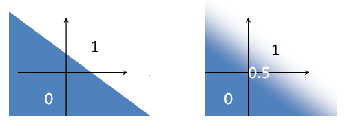
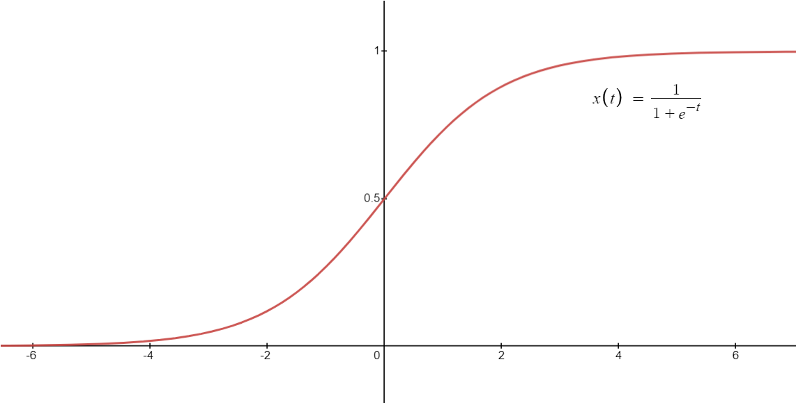
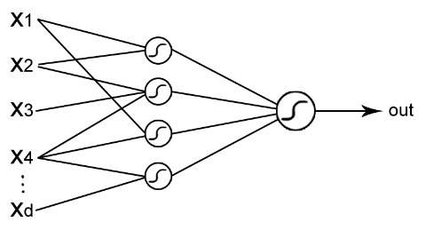

## Reti neurali

Il nostro cervello è composto da circa $10^{11}$ neuroni (unità computazionali)
e $10^{15}$ sinapsi (connessioni).

Il neurone ha un funzionamento molto semplice, in base allo stimolo che riceve,
è in grado di inviare o no uno stimolo elettrico ai suoi vicini.

Sistemi complessi come il cervello umano si formano dall'interazione di un gran
numero di unità semplici.

### Architettura MLP (Multiple Layer Perceptron)

Il neurone _artificiale_ (detto perceptron), è riprodotto con 2 operazioni
matematiche in sequenza:

- prodotto scalare $\mathbf{W} \cdot \mathbf{x}$;
- funzione sigmoidale;

In questo modo abbiamo creato una funzione in grado di dividere uno spazio in 2
a seconda dell'input dato:

- a sinistra si vede lo spazio diviso usando solo il prodotto scalare;
- a destra è stata applicata la funzione sigmoidale;

#### Funzione sigmoidale

La funzione sigmoidale imita il comportamento di un neurone naturale, infatti il
segnale che esso invia cresce gradualmente tra l'intensità minima e la massima.

Essa fa parte di una famiglia di funzioni **non lineari** dette funzioni di
**squashing**. Queste funzioni sono limitate superiormente e inferiormente.
Quella usata più comunemente è:

$$
f(x) = \frac{1}{1 + e^{-x}}
$$

Applicando la funzione sigmoidale, si può far rientrare l'output del prodotto
scalare in un intervallo $[0, 1]$. L'output della funzione può essere
interpretato come una probabilità.

#### Layers

Gli MLP sono composti da un gran numero di unità parallele interconnesse,
organizzate in strati. L'output di uno stato diventa l'input dello strato
successivo.

In un modello con almeno un layer nascosto (non di input o di output), si può
ottenere un modello flessibile capace di approssimare qualsiasi funzione
$\in C^1$.

## Backpropagation

- Prendo una funzione guida da ottimizzare (come la somma degli errori quadrati
  visti in precedenza ($E(w)$)).
- Uso il gradient descent per trovare il valore ottimale dei pesi.

La backpropagation è l'operazione di calcolo del gradiente e spostamento di un
piccolo valore verso il punto di minimo.

Dato che il nostro modello è una composizione di funzioni, dovrò usare la regola
della catena per trovare il gradiente.

$$
\dv{f}{x} = \dv{f}{g} \dv{g}{x}
$$

### Come non 'incastrarsi' in minimi locali?

È un problema non ancora risolto, però i risultati sul campo dimostrano che è
possibile allenare modelli affidabili anche fermando la discesa su punti di
minimo locale.
