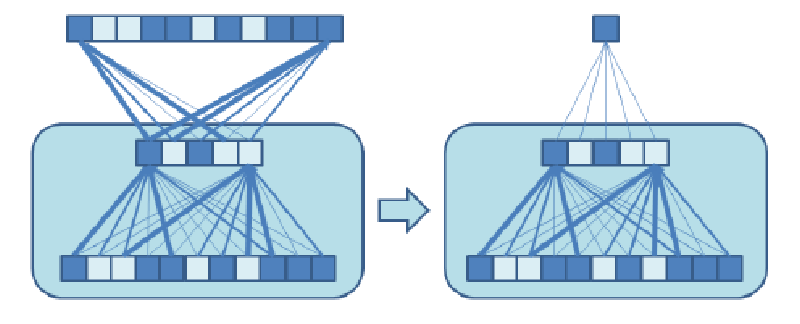

## Learning rate

Quando mi sposto durante la discesa del gradiente, come stabilisco di quanto
spostarmi?

- se mi muovo di troppo, rischio di 'saltare' il punto di minimo;
- se mi muovo di troppo poco, l'apprendimento richiederà troppo tempo;

### Bold driver backpropagation

- Se step successivi diminuiscono $E(w)$, possiamo aumentare lo spostamento
  esponenzialmente.
- La prima volta che il valore di $E(w)$ sale invece che scendere, diminuiremo
  in fretta la velocità.

### On-line or stochastic backpropagation

$E(w)$ è una somma degli errori su tutti gli esempi. Di conseguenza, anche il
gradiente è una somma dei corrispondenti gradienti di ogni esempio.

Invece di minimizzare la somma di tutti i gradienti, ogni volta che aggiungo un
esempio $p$, preso casualmente dal training set, ne calcolo il gradiente e
faccio un piccolo step ($\epsilon$) verso il minimo:

$$
w_{k + 1} = w_k - \epsilon \nabla E_p(w_k)
$$

Questo rende l'operazione di training altamente parallelizzabile anche se si
perde un po' di precisione.

## Reti neurali profonde

Mappare degli input a degli output risulta molto più facile se il modello
contiene più layers nascosti. L'ideale sarebbe che il MLP crei automaticamente
delle rappresentazioni interne (codificate come valori di attivazioni di ogni
layer).

Il problema sta nel calcolo delle derivate dell'errore. La regola della catena
porta le derivate dei primi strati ad avere valori molto piccolo (che il
computer approssima a 0). Quindi i pesi nei primi strati avrebbero un valore
casuale, rendendoli inutili.

### Auto-encoders

Gli auto-encoders permettono di costruire rappresentazioni interne degli esempi
in maniera non supervisionata.

Quando costruiamo una rete a strati, chiediamo che il modello, dato un input,
riproduca semplicemente quell'input come suo output. In questo modo non c'è
bisogno di avere un sistema che deve etichettare in maniera corretta gli esempi.

Se la rete è ha un collo di bottiglia, ovvero ci sono strati interni con meno
variabili di quello di input, allora la rete sarà forzata a trovare delle
regolarità nei casi esempio.

Questo tipo di modelli sta alla base di quasi tutti i modelli in grado di
generare immagini.

### Regressione con reti neurali non supervisionate

Se noi rimuoviamo la parte superiore del tipo di modello visto sopra, possiamo
ricombinare i valori dei pesi utili per il riconoscimento (**senza
modificarli**) per ottenere un singolo numero in output.

