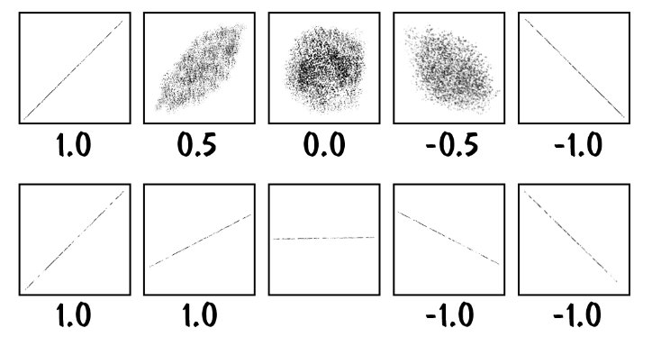

## Varietà

In geometria, una varietà è uno spazio che localmente è simile ad uno spazio
euclideo, ma che globalmente può avere proprietà diverse.

Data una varietà, è possibile interpolare (localmente) 2 punti con una certa
funzione dipendente da un parametro

L'intelligenza artificiale generativa funziona così, di solito partendo da
un'immagine casuale, si avvicina il valore di ogni pixel a quello che dovrebbe
essere quello corretto.

## Derivate parziali

Per trovare la derivata parziale di una funzione, bisogna calcolare qual'è il
cambiamento in output di un piccolo cambiamento di $w$. Poi quando ho questo
valore, divido $E(w)$ per quel valore e trovo la derivata parziale di $E$
rispetto a $w$ nel punto $w$.

## Feature selection

Nel modo reale, i dati che usiamo per allenare un modello possono essere
duplicati, irrilevanti o mancanti.

Bisogna quindi prendere un sottoinsieme dei dati per ottenere i seguenti
vantaggi:

- riduzione di dimensionalità;
- riduzione dell'utilizzo di memoria;
- miglior generalizzazione;
- maggiori possibilità di spiegare come funziona il modello (dovuto al minor
  numero di dimensioni);

Il processo di feature selection non ha una soluzione unica, serve molto intuito
e conoscenza del dominio. Ci sono però 3 di metodi efficaci:

- **Wrapper methods**: Si testa ogni combinazione di features del training set,
  poi si tiene quella che dà l'errore minore.

  Per disabilitare una feature, moltiplico il vettore di input per uno dove le
  componenti sono 0 (feature disabilitata) o 1 (feature abilitata). Quindi dato
  un input a $n$ dimensioni, avrò $2^n$ possibili combinazioni di features.

- **Filter methods**: Al posto di usare l'errore, che richiede il training di
  molti modelli diversi (costoso). Si possono provare ad usare altri indici che
  predicono quanto una variabile potrebbe influire sul risultato finale. Alcuni
  esempi sono la correlazione l'informazione mutua tra 2 variabili.

- **Embedded methods**: Le features vengono selezionate durante il training,
  portando a $0$ i pesi di quelle che si vuole disabilitare.

Ci sono 2 modi di procedere per scegliere le features:

- bottom-up: si inseriscono features in ordine di importanza fino a quando
  l'errore non smette di scendere;
- top-down: si eliminano progressivamente features fino a quando si ottengono le
  performance migliori (sia di errore, sia di grandezza del modello);

:::caution

Si può associare il valore di un peso all'importanza di una feature solo se il
valore dell'input era stato normalizzato in precedenza.

:::

:::caution

Misurare alcune features in maniera isolata, può rimuovere dal modello le
relazioni mutuali tra le diverse componenti. Quindi i metodi di filtro possono
talvolta darci informazioni non corrette.

:::

### Coefficiente di correlazione

Per misurare relazioni di tipo lineare (che formano una retta su uno scatter
plot) tra 2 variabili, si usa il coefficiente di correlazione di Pearson:

$$
\rho_{X_i, Y} = \frac{\text{cov}[X_i, Y]}{\sigma_{X_i} \sigma_Y} = \frac{\mathbb{E}[(X_i - \mu_{X_i})(Y - \mu_Y)]}{\sigma_{X_i} \sigma_y}
$$

Per 2 variabili altamente correlate (valore vicino a $1$ o $-1$), la conoscenza
di $X_i$, ci dice quale sarà il valore di $Y$.

Anche se una feature ha correlazione $0$, non è detto che essa non contenga
informazioni sull'output. La loro relazione potrebbe essere di tipo non lineare.

