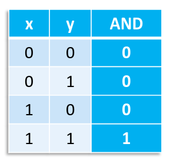

## Tabelle della verità

I valori delle funzioni booleane possono essere rappresentati usando le tabelle
della verità.

Ad ogni combinazione dei valori delle variabili, corrisponde una riga della
tabella.

Con $n$ variabili e codominio $B$, sono possibili $2^n$ diverse combinazioni.
Funzioni di decine di variabili sono comuni, quindi occorre trovare una
rappresentazione più compatta.

## Espressioni

Una funzione può essere rappresentata come un'espressione facente uso degli
operatori già definiti (Esempio: $f(a, b, c) = a b + b' c$).

Convenzionalmente si da precedenza all'operazione $\text{AND}$ rispetto alla
$\text{OR}$ (come la moltiplicazione ha precedenza sull'addizione).

Un'espressione può essere realizzata fisicamente collegando i circuiti delle
porte logiche di base.

Diverse espressioni possono rappresentare la stessa funzione. Per esempio
$ab + b'c = a'b'c + ab'c + abc' + abc$. Ovviamente si usa sempre la più corta,
dato che ogni porta logica impiega un piccolo periodo di tempo per svolgere la
propria operazione.

### Manipolazioni algebriche

2 espressioni sono equivalenti se rappresentano la stessa funzione. Usiamo
alcune proprietà per derivare una nuova espressione equivalente a quella data.

- **identità**:
  - $x + 0 = x$
  - $x\ 1 = x$

- **proprietà commutativa**:
  - $x + y = y + x$
  - $x y = y x$

- **proprietà distributiva**:
  - $x (y + z) = (x y) + (x z)$
  - $x + (y z) = (x + y) (x + z)$

- **complementazione**:
  - $x + x' = 1$
  - $x x' = 0$

- **proprietà associativa**:
  - $x + (y + z) = (x + y) + z$
  - $x (y z) = (x y) z$

  Permette di definire in maniera univoca le operazioni $\text{AND}$ ed
  $\text{OR}$ con più di 2 variabili.

- **legge dell'elemento nullo**:
  - $x + 1 = 1$
  - $x\ 0 = 0$
- **involuzione**: $(x')' = x$

- **idempotenza**:
  - $x + x = x$
  - $x x = x$
- **assorbimento**:
  - $x + xy = x$
  - $x (x + y) = x$
- **semplificazione**:
  - $x + x'y = x + y$
  - $x (x' + y) = xy$
- **adiacenza**:
  - $xy + xy' = x$
  - $(x + y) (x + y') = x$
- **legge di De Morgan**:
  - $(x + y)' = x' y'$
  - $(x y)' = x' + y'$
  - $(x' + y')' = x y$
  - $(x' y')' = x + y$

## Teorema di espansione di Shannon

Data una funzione booleana $f$ di $n$ variabili, l'espansione di Shannon è
l'identità:

$$
f = x_1 f_{x_1} + x_1' f_{x_1'}
$$

dove $x_1$ è una delle variabili che viene fissata a $1$ e $f_{x_1}$ e
$f_{x_1'}$ sono restrizioni di $f$ di $n - 1$ variabili, dove $x_1$ diventa
costante.

Possiamo continuare l'espansione per le 'sottofunzioni' che abbiamo trovato. Una
volta completato questo processo ricorsivo otterremo un'espressione che viene
detta **forma canonica**.

L'espansione completa di una funzione è un'espressione univoca, quindi per
verificare che 2 funzioni rappresentino la stessa logica si può verificare
l'uguaglianza della forma canonica.

**Corollario**: qualunque funzione booleana può essere espressa mediante gli
operatori logici di base $\text{AND}$ e $\text{OR}$.

### Forma canonica di un'espressione booleana

I 2 tipi di forme canoniche che si possono ottenere dall'espansione hanno una
nomenclatura specifica:

- **sum of products** (SOP): somma in cui ogni termine è il prodotto di
  variabili affermate se valgono 1 o negate se valgono 0;
- **product of sums** (POS): prodotto in cui ogni termine è una somma di
  variabili affermate se valgono 0 o negate se valgono 1, si ottiene modificando
  leggermente il teorema di Shannon;
