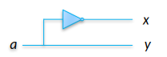
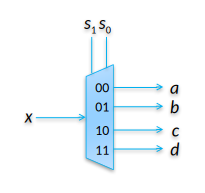
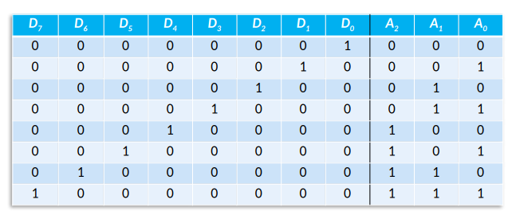

## Circuiti combinatori fondamentali

Una mappa di Karnaugh è usabile con funzioni che arrivano al massimo a 4/5
variabili. Per funzioni più complesse conviene usare un metodo gerarchico: si
combinano blocchi più semplici per realizzare circuiti complessi (un po' come
passare dall'assembly al C).

### Multiplexer 4 a 1

Funzione a 4 ingressi di dato ($a$, $b$, $c$, $d$) + 2 ingressi di controllo
($s_0$ e $s_1$).

Possiamo usare il multiplexer 2 a 1 che già conosciamo per creare questo
componente più complesso. Per esempio:

- 1° livello: si sceglie tra $a$ e $b$ e tra $c$ e $d$ usando $s_0$;
- 2° livello: si sceglie tra i 2 rimasti usando $s_1$;

Il simbolo che si usa per rappresentare il multiplexer è:

Esempi di utilizzo:

- condivisione di risorse;
- realizzazione dispositivi programmabili;
- selezione di celle di memori;

### Decoder

Decodificare significa passare da $n$ a $m$ cifre, dove:

- $n \leq m \leq 2^n$;
- ad ogni valore di ingresso corrisponde un unico valore in uscita;

Con $m$ cifre potrei rappresentare $2^m$ codici, ma ne uso solo $2^n$.

Decodifica 2 a 1: la prima uscita vale 1 se l'ingresso vale 0, la seconda vale 1
se l'ingresso vale 1.

Il simbolo che si usa per rappresentare il decoder è:

Da notare i valori entrambi 0 o 1 in uscita non vengono utilizzati.

Esempio di utilizzo: scelta di celle di memoria:

- il processore mette sul bus un indirizzo a $n$ bit;
- metà dei bit indirizza le righe con una decodifica;
- l'altra metà sceglie una colonna con un multiplexer;

:::note

Spesso si decodifica la colonna una volta e poi si cambia il valore del
multiplexer, questo rende l'accesso sequenziale di celle di memoria leggermente
più veloce di un tipo di accesso totalmente casuale.

:::

### Demultiplexer

Prende in ingresso una variabile e la presenta su una uscita a scelta. Le uscite
non selezionate hanno valore 0.

### Encoder

Fa il lavoro contrario del decoder, quindi riduce il numero di ingressi in
uscita rispetto a quelli in ingresso.

Esempio di encoder 8 a 3:

**Priority encoder**: ritorna un numero binario indicante la priorità a seconda
dell'ingresso che ha valore 1. In caso multipli ingressi abbiano valore 1,
ritorna il valore dell'ingresso con priorità più alta.
