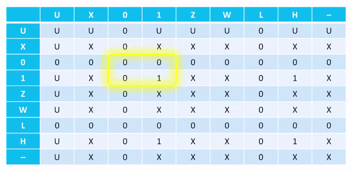

## Espressioni multiple

```vhdl
entity comb_function is
    port (a, b, c : in bit, z : out bit);
end;

architecture expression of comb_function is
    signal d : bit;
begin
    d <= a and b;
    z <= d or c;
end;
```

Il segnale `d` funziona da connessione tra la prima espressione e la seconda.
L'ordine delle espressioni non ha rilevanza. Infatti nell'implementazione
hardware tutto succede allo stesso momento.

## Ritardi

L'operatore `after`, seguito da una misura di tempo, si usa nel testbench per
specificare il tempo da aspettare durante la simulazione dopo il quale il valore
di un ingresso cambia.

Se non viene specificato, VHDL assume comunque un ritardo infinitesimale detto
$\delta$-time.

## Architettura strutturale

Costruiamo un sommatore a 4 bit.

Definiamo l'entità `full_adder`:

```vhdl
entity full_adder is
    port (
        a, b, cin : in bit;
        s, cout : out bit;
    );
end;

architecture equazioni of full_adder is
begin
    s <= a xor b xor cin;
    cout <= (a and b) or (a and cin) or (b and cin);
end;
```

Per il sommatore completo, dobbiamo definire un interfaccia con segnali
multibit. VHDL supporta la definizione di array di valori usando il tipo
`bit_vector`.

```vhdl
entity Adder4 is
    port (
        A, B : in bit_vector(3 downto 0);
        cin : in bit;
        S : out bit_vector(3 downto 0);
        cout : out bit;
    );
end;
```

Costruiamo il sommatore mettendo assieme 4 `full_adder`:

```vhdl
architecture strutturale of Adder4 is
    -- Non serve che l'indice parta da 0. In questo caso fa riferimento al
    -- full_adder corrispettivo.
    signal C : bit_vector(3 downto 1);
begin
    -- Creiamo una istanza per ogni full_adder.
    FA0: full_adder port map (A(0), B(0), cin, S(0), C(1));
    FA1: full_adder port map (A(1), B(1), C(1), S(1), C(2));
    FA2: full_adder port map (A(2), B(2), C(2), S(2), C(3));
    FA3: full_adder port map (A(3), B(3), C(3), S(3), cout);
end;
```

## Modi dei segnali

Abbiamo visto che i segnali possono essere di ingresso o di uscita.

I segnali d'ingresso (`in`) possono essere soltanto letti e quindi possono
comparire soltanto a destra del segno `<=`.

I segnali d'uscita (`out`) possono essere soltando scritti e quindi possono
comparire soltanto a sinistra del `<=`. Solo un espressione alla volta può
assegnare ad un segnale in uscita, altrimenti si generano dei conflitti.

I segnali d'uscita possono essere anche letti, ma devono essere dichiarati come
`buffer` invece che `out`. In questo caso possono comparire a sinistra (solo una
volta) o a destra dell'assegnazione.

I segnali interni si comportano sempre come `buffer`.

I segnali `inout` sono segnali che dal punto di vista del componente si
comportano come `buffer`, ma possono essere scritti e letti anche dall'esterno.
Quindi essi possono apparire a sinistra dell'assegnazione in più espressioni.

Normalmente questi segnali si usano per implementare bus dove più periferiche
possono scrivere contemporaneamente.

## Parametri (generic)

Spesso è utile parametrizzare un componente, in modo da scriverne la definizione
solo una volta.

```vhdl
-- Porta and con ritardo parametrizzato e default.
entity And2 is
    generic (delay : time := 5ns);
    port (x, y : in bit; z : out bit);
end;

architecture ex2 of And2 is
begin
    z <= x and y after delay;
end;
```

## Costanti

Le constanti si usano per definire valori simbolici da usare nel resto del
codice. Servono ad evitare duplicazioni e 'numeri magici'.

```vhdl
architecture equazioni of display is
    constant segmenti : integer := 7;
    constant cinque : bit_vector(segmenti - 1 downto 0) := "1101101";
begin
    uscita <= cinque when ingresso = 5;
end;
```

## Tipi

Ogni segnale deve avere un tipo. Abbiamo visto `bit` che rappresenta un semplice
bit di valori 0 e 1.

`bit_vector` rappresenta un array di bit.

- `downto` rappresenta l'ordinamento dei bit, dove:

  ```vhdl
  architecture ex of example is
      signal b : in bit_vector(3 downto 0);
  begin
      b <= "1100";
  end
  ```

  `b(3)` e `b(2)` hanno valore 1 e `b(1)` e `b(0)` hanno valore 0.

- `to` è l'ordinamento contrario dove `b(3)` e `b(2)` avrebbero ottenuto i
  valori 0 e `b(1)` e `b(0)` i valori 1.

Di solito si usa `downto` perchè è il più intuitivo.

Altri tipi che abbiamo visto sono `integer` e `time`.

### Tipi complessi

Come con il `typedef` in C, è possibile definire nuovi tipi anche in VHDL:

```vhdl
type word is bit_vector(15 downto 0);
```

Altri tipi compositi si definiscono nei seguenti modi:

```vhdl
-- enum
type hex_digit is ('0', '1', '2', '3', '4', '5', '6', '7', '8', '9', 'A', 'B', 'C', 'D', 'E', 'F');

-- array
type my_word is array (15 downto 0) of hex_digit;

-- struct
type packet is record
    RISE_TIME : time;
    FALL_TIME : time;
    SIZE : integer range 0 to 200;
    DATA : bit_vector (15 downto 0);
end;
```

### `std_logic`

Il tipo `std_logic` è un tipo standardizzato (libreria standard 1164 della IEEE)
che sostituisce `bit` con una versione più realistica:

| valore | significato                                                |
| ------ | ---------------------------------------------------------- |
| `U`    | Segnale non definito (non è mai stato assegnato un valore) |
| `X`    | Segnale sconosciuto (valore non determinabile)             |
| `0`    | 0 logico                                                   |
| `1`    | 1 logico                                                   |
| `Z`    | Alta impedenza (utile su segnali `inout`)                  |
| `W`    | Segnale debole (valore non determinabile)                  |
| `L`    | Segnale debole che dovrebbe andare a 0                     |
| `H`    | Segnale debole che dovrebbe andare a 1                     |
| `-`    | Indifferente (don't care)                                  |

```vhdl
library ieee;
use ieee.std_logic_1164.all;

entity decoder is
    port (
        i : in std_logic_vector(1 downto 0);
        o : out std_logic_vector(3 downto 0);
    )
end;
```

**Esempio**: tabella di verità di `and`:



## Espressioni condizionate

In una espressione non si può usare lo statement if. In VHDL ci sono 2 tipi di
operatori:

- **Assegnazione condizionata**:

  ```vhdl
  architecture with_condition of decoder is
  begin
      o <= "0001" when i = "00" else
           "0010" when i = "01" else
           "0100" when i = "10" else
           "1000" when i = "11" else
           "XXXX";
  end;
  ```

- **Assegnazione selezionata**:

  ```vhdl
  architecture with_select of decoder is
  begin
      with i select
      o <= "0001" when "00",
          "0010" when "01",
          "0100" when "10",
          "1000" when "11",
          "XXXX" when others;
  end;
  ```

  Utile perchè si possono guardare condizioni su segnali diversi, aggregandoli.
