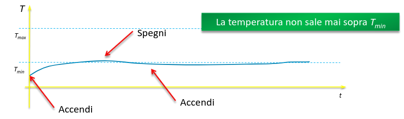
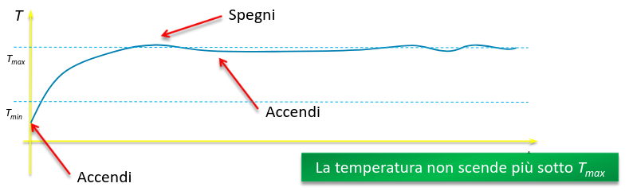
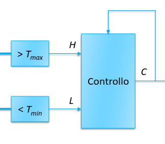
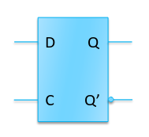
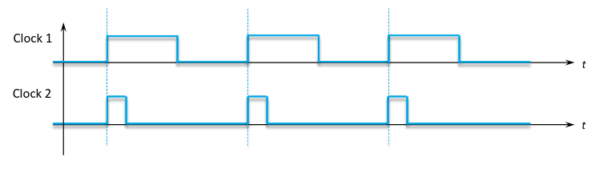
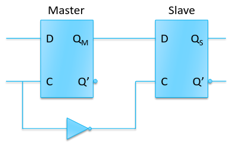
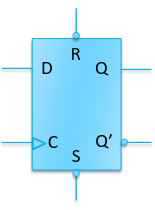
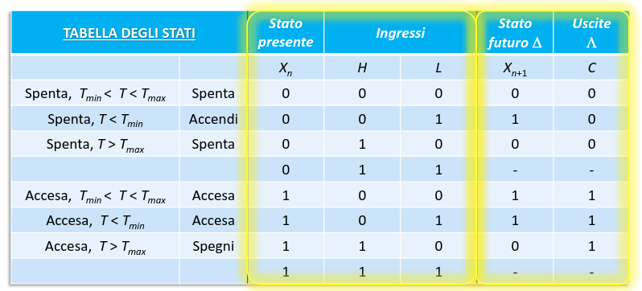
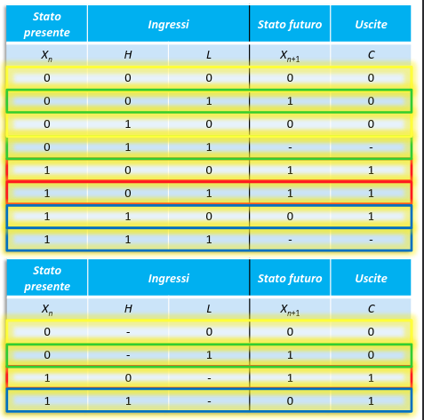

## Circuiti sequenziali

Fin'ora abbiamo visto funzioni booleane, per cui ad ogni combinazione degli
ingressi è associato un valore d'uscita. Data la stessa combinazione di
ingressi, si ottiene sempre la stessa uscita.

Nei circuiti sequenziali invece, il comportamento può essere influenzato anche
dal **risultato delle esecuzioni precedenti**.

### Circuito della caldaia

Vogliamo creare un circuito che accende e spegne una caldaia a seconda del
valore della temperatura $T$.

Definiamo 2 input:

- $H$ sarà $1$ quando $T > T_\text{max}$
- $L$ sarà $1$ quando $T < T_\text{min}$

Si può creare la tabella della verità:

| H   | L   | C   |
| --- | --- | --- |
| 0   | 0   | ?   |
| 0   | 1   | 1   |
| 1   | 0   | 0   |
| 1   | 1   | -   |

Non si può mai verificare il caso in cui $H = L = 1$. Inoltre, bisogna stabilire
cosa mettere per $H = L = 0$:

- Se la tengo spenta:

  

- Se la tengo accesa:

  

Occorrono 2 valori diversi per questo caso: $1$ se stavo già scaldando e $0$ se
non stavo scaldando. Quindi occorre guardare il valore di output precedente:

---

I circuiti il cui output varia a seconda della storia dei precedenti valori
d'uscita sono detti circuiti sequenziali.

Per realizzarli è necessario creare una memoria, che si realizza riportando
l'uscita o un nodo interno all'ingresso. Il valore dentro alla memoria viene
detto **stato** del circuito.

Lo **stato futuro** del circuito è il valore uscente dal circuito e che verrà
memorizzato per il prossimo calcolo.

È conveniente separare la parte di memoria del circuito in un componente
separato e ben definito.

### Circuiti sequenziali sincroni e asincroni

- Nei **circuiti asincroni** lo stato può cambiare ad ogni istante, a causa di
  un cambiamento dello stato futuro. Ciò può portare a variazioni sugli ingressi
  o sullo stato presente.

- Nei **circuiti sincroni** lo stato viene aggiornato solo in corrispondenza di
  un certo segnale di sincronizzazione detto **clock**.

  I circuiti sincroni sono più semplici perché non c'è più una dipendenza tra il
  valore di stato presente e quello futuro. Ciò consente di disaccoppiare la
  lettura e il calcolo dello stato.

## Latch D

Il latch D è un componente che si comporta come una porta:

- Quando $C = 1$, la porta è aperta e l'uscita segue le variazioni dell'ingresso
  $D$.
- Quando $C = 0$, la porta è chiusa e l'uscita diventa l'ultimo valore su $D$
  prima che $C$ passasse a $0$.

Esiste anche un altra variante, detta a clock attivo basso, con l'ingresso C
negato e che quindi lascia passare il valore in ingresso se $C = 0$.

### Come usare il latch per memoria

Il latch D può essere usato come cella di memoria per un circuito sequenziale.
Si collegano le porte $D$ e $Q$ alla rete combinatoria e la porta $C$ ad un
clock che scandirà il ritmo del circuito.

Il circuito passa attraverso 2 fasi:

- clock basso: la rete calcola le nuove uscite e il nuovo stato futuro;
- clock alto: lo stato futuro diventa stato presente e il calcolo ricomincia;

### Problemi del latch D

Il principale problema del latch D è la sua instabilità durante la fase di clock
alto. Se la rete combinatoria è molto veloce, lo stato futuro potrebbe mutare di
nuovo finché il clock è attivo, lasciando un valore inaspettato in memoria.

:::caution

Il circuito può cambiare stato più volte durante una fase attiva del clock.

:::

#### Soluzione

La soluzione più facile sarebbe quella di avere un clock con una fase attiva
(duty cycle) molto corta, in questo modo la rete combinatoria non sarà in grado
di calcolare un nuovo valore in tempo.

**Problema**: per accorciare la lunghezza del duty cycle occorre un segnale con
banda maggiore, e quindi una maggiore potenza. Questo fa alzare i costi.

## Flip flop edge triggered

Il valore di questo tipo di flip flop cambia solamente quando ci sono
transizioni di valore del clock, eliminando i problemi legati al lungo periodo
in cui il clock rimane aperto.

Per realizzarlo si mettono 2 latch D in opposizione, il primo detto **master** e
il secondo detto **slave**. Non c'è mai un collegamento diretto tra l'ingresso e
l'uscita.

1. Quando $C = 1$ il master si apre e memorizza il valore in ingresso. Il valore
   in uscita non cambia perché lo slave è chiuso.
2. Quando $C = 0$ il master si chiude e lo slave diventa trasparente. Non ci
   sono variazioni in uscita perché lo slave ritorna semplicemente il valore
   memorizzato nel master.

:::note

Il simbolo usato per rappresentare il flip flop è uguale a quello del latch D,
solo con un triangolo sulla porta $C$.

:::

Ci sono 2 varianti del flip flop:

- negative edge triggered: il valore su $D$ viene memorizzato quando il clock
  passa a valore $0$;
- positive edge triggered: il valore su $D$ viene memorizzato quando il clock
  passa a valore $1$;

:::note

Le memorie SDRAM (Synchronous Dynamic RAM) sono implementate circa in questo
modo. Quelle DDR (Double Data Rate) usano entrambi i fronti del clock.

:::

### Preset e clear

È importante inizializzare i circuiti con memoria con un valore noto. Lo si può
fare al primo fronte attivo del clock oppure usando segnali asincroni (che hanno
effetto immediatamente).

Gli ingressi preset e clear servono a questo. Di solito si attivano portando il
valore sull'ingresso corrispettivo a $0$.

- Se $S = 0$, $Q$ va a $1$;
- Se $R = 0$, $Q$ va a $0$;

## Macchine a stati finiti

Lo stato è l'insieme dei valore contenuti nella memoria del circuito, quindi in
generale è un vettore di variabili booleane (ciascuna memorizzata tramite un
flip flop). Ogni variabile dello stato presente ha una corrispondente variabile
nello stato futuro.

Durante ogni ciclo del clock lo stato presente non cambia, mentre lo stato
futuro può cambiare anche più volte. Il passaggio da uno stato all'altro del
circuito si chiama **transazione**.

### Equazioni di stato

Lo stato corrispondente al ciclo $n$-esimo del clock viene indicato con $X(n)$.
Quello futuro $Y(n) = X(n + 1)$ dipende sia dal valore degli ingressi ($IN(n)$),
sia dal valore corrente dello stato:

$$
Y(n) = \Delta(IN(n), X(n))
$$

Le uscite del circuito $OUT(n)$ dipendono dagli ingressi e dallo stato secondo
una funzione combinatoria ($\Lambda$)

$$
OUT(n) = \Lambda(IN(n), X(n))
$$

:::note

Ovviamente lo stato presente non dipende dallo stato futuro!

:::

### Tabella degli stati

Ritornando all'esempio della caldaia di prima, possiamo scrivere tutti gli stati
che il circuito può assumere in una tabella simile alla tabella della verità:

La tabella si può semplificare: se 2 righe hanno lo stesso stato presente, stato
futuro e uscita, rappresentano la stessa transazione:

