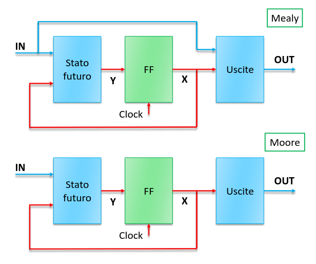

## Analisi di circuiti sequenziali

Dato un circuito sequenziale, si può facilmente risalire al suo diagramma degli
stati:

1. deriviamo l'espressione dello stato futuro (in funzione degli ingressi
   primari e dello stato presente);
2. deriviamo l'espressione delle uscite;

Durante un ciclo di clock:

- cambia solo lo stato futuro, quello presente muta solo al fronte di ogni
  ciclo;
- le uscite possono cambiare se cambiano gli ingressi;

La velocità del clock è legata a quella della rete combinatoria. Lo stato futuro
deve ottenere un valore stabile entro il prossimo fronte attivo del clock.
Quindi il ritardo introdotto dalla rete combinatoria definisce la massima
frequenza del clock.

A livello di flip flop, il segnale sull'ingresso $D$ dovrà essere stabile per un
certo tempo prima e dopo il fronte attivo del clock.

- **tempo di setup**: tempo prima del fronte durante il quale $D$ deve essere
  stabile;
- **tempo di hold**: tempo dopo il fronte durante il quale $D$ deve essere
  stabile;

Se queste condizioni non sono rispettate, il flip flop può finire in uno stato
casuale.

### Violazioni dei tempi del flip flop

Se ci sono violazioni del tempo di setup, il circuito è troppo lento:

- lo stato futuro non viene calcolato in tempo;
- bisogna velocizzare il circuito o rallentare il clock;

**Processo di binning**: selezione dei circuiti più veloci. La differenza di
velocità è dovuta ad imperfezioni durante il processo di manifattura.

---

Se ci sono violazioni del tempo di hold, il circuito è troppo veloce. Si
verifica spesso solo per alcuni flip flop che dipendono da altri nel circuito:

- non si può modificare la velocità del clock perchè condizionerebbe tutti i
  flip flop;
- bisogna rallentare la rete combinatoria aggiungendo dei buffer;

## Macchine di Mealy e di Moore

- **Macchina di Mealy**: caso generale di un circuito sequenziale, le uscite
  dipendono sia dallo stato corrente che dagli ingressi.
- **Macchina di Moore**: circuito sequenziale in cui le uscite dipendono solo
  dallo stato corrente e non dagli ingressi. Potenzialmente l'uscita può essere
  ritardata di un ciclo di clock rispetto alla variazione degli ingressi.

### Potenziali problemi delle macchine di Mealy

In generale più macchine a stati possono essere usate contemporaneamente. In
questo caso le uscite di una diventano ingressi dell'altra e viceversa.

Quindi si possono creare degli anelli di feedback combinatori, che è di nuovo il
problema che cercavamo di risolvere con i circuiti sequenziali.

Con le macchine di Moore questo problema non si presenta, quindi di solito si
sacrifica un po' di performance per avere questa garanzia di correttezza.
