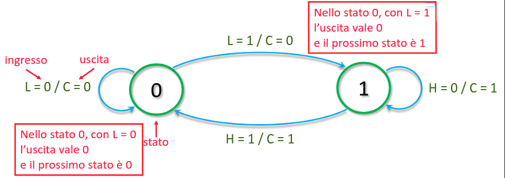

## Diagramma degli stati

Il diagramma degli stati è un modo più semplice di rappresentare un circuito
sequenziale:

- ogni stato diventa un cerchio con il valore delle sue variabili (stato
  presente);
- ogni transizione diventa una freccia dallo stato presente al futuro;
- sulla freccia si indicano anche il valore degli ingressi e delle uscite dello
  stato di partenza;

Il diagramma ha le seguenti caratteristiche:

- per $n$ variabili di stato, il diagramma avrà $2^n$ stati diversi;
- per $m$ variabili di ingresso, ogni stato avrà $2^m$ transizioni;

Quindi la tabella degli stati avrà $2^{n + m}$ righe.

:::note

Dato che il numero di stati deve essere una potenza di 2, a volte si creano
stati che non sono effettivamente raggiungibili.

:::

La stessa funzione sequenziale può essere rappresentata da diagrammi differenti.
Bisogna trovare quello che ne usa il numero minore.

## Codifica degli stati

Il valore assegnato ad ogni variabile di stato è arbitrario. Nel caso della
caldaia si avrebbe potuto codificare l'accensione con uno $0$ e lo spegnimento
con un $1$. Di solito si lascia il sintetizzatore a decidere qual'è la codifica
più performante.

L'importante è che i valori delle uscite del circuito corrispondano a quelli
attesi.

### Codifica one-hot

Normalmente uno stato di 4 variabili può essere espresso con 2 bit ($A = 00$,
$B = 01$, $C = 11$, $D = 10$). A volte può essere utile esprimerlo come 4
variabili ($A = 1000$, $B = 0100$, $C = 0010$, $D = 0001$).

Questo permette, in alcuni casi, di generare circuiti più semplici e quindi più
veloci.

## Analisi di circuiti sequenziali

Dato un circuito sequenziale, si può facilmente risalire al suo diagramma degli
stati:

1. deriviamo l'espressione dello stato futuro (in funzione degli ingressi
   primari e dello stato presente);
2. deriviamo l'espressione delle uscite;

La velocità del clock è legata a quella della rete combinatoria. Lo stato futuro
deve ottenere un valore stabile entro il prossimo fronte attivo del clock.
Quindi il ritardo introdotto dalla rete combinatoria definisce la massima
frequenza del clock.

A livello di flip flop, il segnale sull'ingresso $D$ dovrà essere stabile per un
certo tempo prima e dopo il fronte attivo del clock.

- **tempo di setup**: tempo prima del fronte durante il quale $D$ deve essere
  stabile;
- **tempo di hold**: tempo dopo il fronte durante il quale $D$ deve essere
  stabile;

Se queste condizioni non sono rispettate, il flip flop può finire in uno stato
casuale.

### Violazioni dei tempi del flip flop

Se ci sono violazioni del tempo di setup, il circuito è troppo lento:

- lo stato futuro non viene calcolato in tempo;
- bisogna velocizzare il circuito o rallentare il clock;

**Processo di binning**: selezione dei circuiti più veloci. La differenza di
velocità è dovuta ad imperfezioni durante il processo di manifattura.

---

Se ci sono violazioni del tempo di hold, il circuito è troppo veloce. Si
verifica spesso solo per alcuni flip flop che dipendono da altri nel circuito:

- non si può modificare la velocità del clock perch condizionerebbe tutti i flip
  flop;
- bisogna rallentare la rete combinatoria aggiungendo dei buffer;

## Macchine di Mealy e di Moore

- **Macchina di Mealy**: caso generale di un circuito sequenziale, le uscite
  dipendono sia dallo stato corrente che dagli ingressi.

  

- **Macchina di Moore**: circuito sequenziale in cui le uscite dipendono solo
  dallo stato corrente e non dagli ingressi. Potenzialmente l'uscita può essere
  ritardata di un ciclo di clock rispetto alla variazione degli ingressi.

  

### Potenziali problemi delle macchine di Mealy

In generale più macchine a stati possono essere usate contemporaneamente. In
questo caso le uscite di una diventano ingressi dell'altra e viceversa.

Quindi si possono creare degli anelli di feedback combinatori, che è di nuovo il
problema che cercavamo di risolvere con i circuiti sequenziali.

Con le macchine di Moore questo problema non si presenta, quindi di solito si
sacrifica un po' di performance per avere questa garanzia di correttezza.

## Progetto di un circuito sequenziale

I passaggi per realizzare un circuito sequenziale sono:

1. Progetto del diagramma degli stati;
2. Derivazione della tabella della verità degli stati;
3. Per ogni uscita o variabile di stato futuro semplifichiamo la rispettiva
   mappa di Karnaugh;
4. Dai risultati della semplificazione si ottiene l'espressione logica da usare;
5. Si crea il circuito con le porte date dall'espressione logica;

## Diagramma temporale

Anche per i circuiti sequenziali è possibile disegnare un diagramma temporale:

Lo stato sarebbe composto da multiple variabili, ma di solito lo si comprime in
una riga, indicando semplicemente il valore assunto e i punti in cui esso
cambia.
