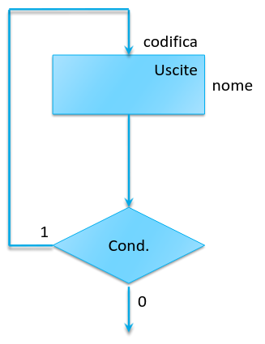
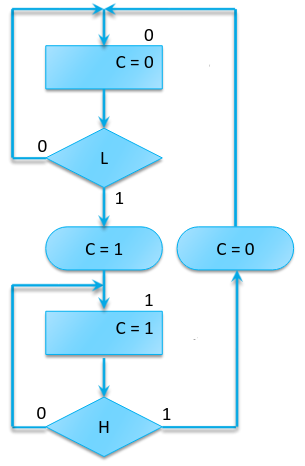
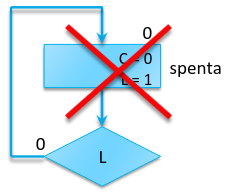
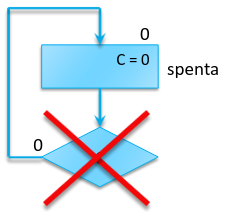
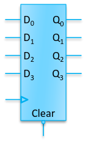
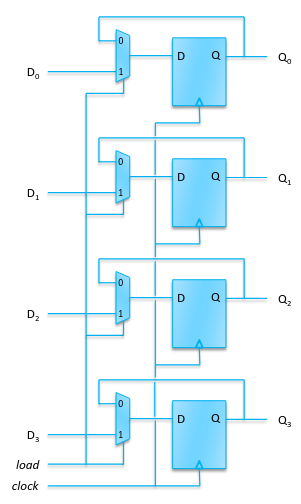
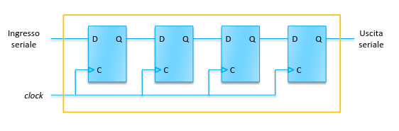
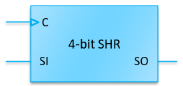

## Algorithmic State Machines (ASM)

Il diagramma ASM è simile ad un diagramma di flusso.

Componenti:

- I rettangoli rappresentano gli stati e sono etichettati con:
  - un nome;
  - l'eventuale codifica;
  - i valori delle uscite (per le macchine di Moore);

I rombi rappresentano una condizione sugli ingressi e generano 2 rami, a seconda
del risultato.

Le transizioni sono rappresentate da frecce che vanno da uno stato ad un altro,
eventualmente passando per delle condizioni.

Per rappresentare macchine di Mealy, bisogna aggiungere delle uscite
condizionate: un rettangolo ad angoli stondati specifica il valore delle uscite
durante le transizioni di stato.

### Regole generali

Non si deve mai assegnare un valore agli ingressi. Per definizione non si può
decidere il valore di un ingresso.

Non si deve mai usare un'uscita in una condizione di transizione.

È possibile mettere 2 condizioni in sequenza sulla stessa transizione. È
importante però che la transizione finisca sempre su uno stato e non si crei un
ciclo composto solamente da condizioni.

Ogni stato definisce il valore dell'uscita, quindi se non si specifica un
valore, si assume sempre che esso ritorni a $0$.

## Circuiti sequenziali di base

### Registro parallelo

L'unità di memoria di base (che contiene un solo bit) è il flip-flop che abbiamo
già visto. Un gruppo di flip-flop correlati è detto registro.

L'ingresso clear pone immediatamente il valore dell'uscita a $0$, fino al primo
fronte attivo del clock in cui il segnale non è più presente.

#### Load-enable

Talvolta si vuole controllare per quali tick del clock si vuole caricare un
nuovo valore.

Per fare ciò si deve mascherare il segnale del clock, facendolo restare costante
fintanto che si vuole mantenere fissato il valore dell'uscita.

**Problema**: Tutti i registri devono commutare nello stesso istante per evitare
comportameti errati. Quindi generalmente si dovrebbero usare alberi di
distribuzione del segnale per bilanciare la distanza da ogni flip flop.

Quindi in sostanza è meglio non toccare il segnale di clock, se non per estreme
ottimizzazioni del circuito.

**Soluzione**: Invece che modificare il segnale del clock, è meglio usare un
multiplexer di fronte al flip-flop. Quindi se il segnale di load è attivo,
ritornerà il valore già memorizzato, altrimenti riprenderà il normale
funzionamento.

### Registro a scorrimento (shift register)

In questo tipo di registro, i flip-flop sono collegati in serie e il caricamento
dei dati avviene un bit alla volta (per ciclo di clock).

#### Load-enable

Anche qua è pericoloso mascherare il clock, perchè il filo tra clock e flip-flop
è generalmente più lungo di quello tra un flip-flop e un altro.

Quindi si può di nuovo aggiungere un multiplexer all'entrata di ogni cella di
memoria.

#### Uscita parallela

Si può facilmente estrarre il dato memorizzato in parallelo tirando fuori un
uscita da ogni flip-flop invece che solamente da quello finale.

#### Ingresso parallelo

Per eseguire il caricamento il parallelo basta aggiungere un'altro ingresso al
multiplexer.

Il multiplexer sarà ora controllato da 2 bit: uno per load-enable e l'altro per
scegliere tra ingresso seriale e parallelo.

#### SHR bidirezionale

L'uscita del flip-flop $n + 1$ viene collegata al multiplexer del $n$-esimo
flip-flop.

La tabella della verità del multiplexer (dove $s_0$ e $s_1$ sono gli ingressi di
controllo) diventa:

| $s_0$ | $s_1$ | modalità                                      |
| ----- | ----- | --------------------------------------------- |
| $0$   | $0$   | nessun cambiamento (load-enable disabilitato) |
| $0$   | $1$   | scorrimento all'indietro                      |
| $1$   | $0$   | caricamento parallelo                         |
| $1$   | $1$   | scorrimento in avanti                         |
