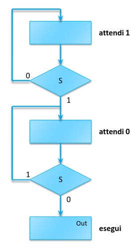
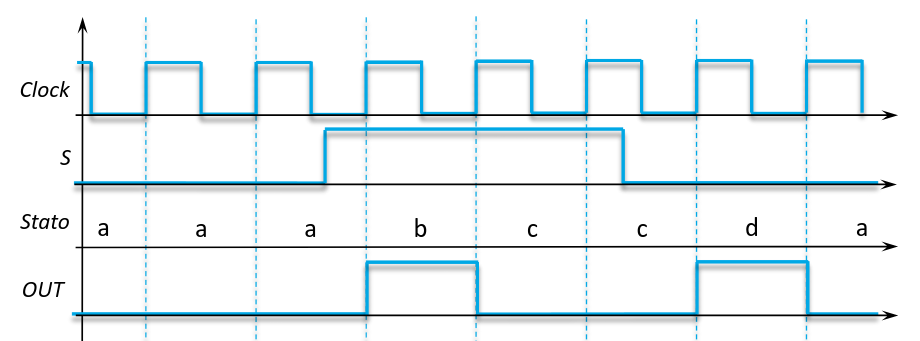
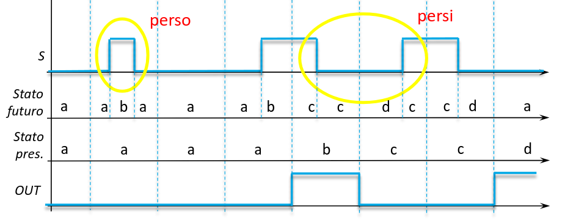

## Edge detector

L'edge detector è un componente che rileva i fronti di salita (o discesa) di un
segnale di ingresso $S$.



Si attende che $S$ vada al valore opposto di quello atteso. Poi si attende che
ritorni al valore specificato.

## Derivatore

Ogni ciclo del clock, quando il segnale d'ingresso cambia di valore, l'uscita
andrà a 1 per il ciclo successivo del clock. Si possono impiegare 2 busy-wait
per rilevare le transizioni sull'ingresso.




**Problema**: Se nello stesso ciclo di clock il segnale torna al valore
iniziale, allora la transizione verrà persa.



Inoltre gli stati $b$ e $d$ non sono sensibili alle variazioni d'ingresso,
quindi tutto ciò che accade in quel ciclo di clock va perso. Per risolvere
questo basta aggiungere una ulteriore condizione dopo i blocchi di stato $b$ e
$d$.

### Correzione per impulso più corto di un ciclo di clock: uscite condizionate

Invece che usare una macchina di Moore, dove le uscite dipendono solamente dallo
stato, si può creare una macchina di Mealy, dove le uscite cambiano anche al
cambiare degli ingressi.

Così cambiamo leggermente la specifica, l'uscita va a 1 immediatamente dopo il
cambiamento dell'ingresso fino alla fine dello stesso ciclo di clock.

Se nello stesso ciclo di clock l'ingresso ha un impulso, l'output sarà solo 1
transizione invece delle 2 che ci si aspetterebbe (salita e discesa
dell'impulso).

## Corse critiche sugli ingressi

Gli ingressi del circuito non sono necessariamente sincronizzati con il clock.
Se il cambiamento di un ingresso avviene nei pressi del fronte del clock, si
possono generare strani comportamenti.

Quando un segnale d'ingresso cambia, il cambiamento deve attraversare tutte le
porte logiche della parte combinatoria del circuito. Se ciò avviene poco prima
del fronte del clock, si può ottenere un risultato intermedio, dovuto alla
propagazione non completa del segnale cambiato.

### Soluzione 1

La prima soluzione può essere quella di far dipendere una variabile di stato per
volta, quando viene cambiato un ingresso.

In questo modo non è possibile finire in combinazioni di stati non esistenti. La
transizione o avviene completamente o viene persa.

Quando non è possibile applicare questa soluzione direttamente, si può
eventualmente introdurre degli stati intermedi, ciascuno distanziato di una
variabile. Questo però introduce ritardi di multipli cicli di clock nel
circuito.

### Soluzione 2

La soluzione più semplice è quella di impedire la corsa critica dall'inizio. Per
fare ciò si pone un flip-flop di fronte all'ingresso che cambia. Quindi il nuovo
valore sarà letto solamente all'inizio del ciclo di clock successivo.

Si introduce un ritardo anche in questo caso.

## Circuiti sequenziali in VHDL

Per memorizzare valori in VHDL basta usare una variabile di tipo `buffer`.

```vhdl
entity latch is
  port (d, c : in std_logic; q : buffer std_logic);
end;

architecture equazioni of latch is
begin
  q <= d when c = '1' else q;
end
```

Si usa un multiplexer con l'uscita collegata ad uno degli ingressi.

Per il flip-flop (edge triggered) si usa l'attributo `'event'`, che rende il
segnale 1 solo quando il valore di `c` cambia:

```vhdl
entity flip_flop is
  port (d, c : in std_logic; q buffer std_logic);
end;

architecture equazioni of flip_flop is
begin
  q <= d when c = '1' and c'event else q;
end;

-- Per discriminare i 2 fronti, si possono usare le funzioni rising_edge e falling_edge:
architecture equazioni of flip_flop is
begin
  q <= d when c = '1' and rising_edge(c) else q;
end
```

## Processi sequenziali

Il circuito si comporta in maniera combinatoria se è sempre possibile assegnare
un valore ai segnali senza dover ricordare quello precedente.

Quindi bisogna (quando possibile) ricordarsi di assegnare alle uscite per tutti
i valori degli ingressi. Altrimenti gli strumenti di sintesi inseriranno un
latch o un flip-flop per ricordare il valore precedente (rimasto lì perché non
lo abbiamo aggiornato).

```vhdl
-- Questo è un circuito esclusivamente combinatorio.
process (a, b, c) is
begin
  if c = '1' then
    if a = '1' or b = '1' then
      y <= '1';
    else
      y <= '0';
    end
  else
    y <= '0';
  end;
end;

-- Se c = '0', il valore di y deve essere memorizzato (viene aggiunto un latch in automatico).
process (a, b, c) is
begin
  if c = '1' then
    if a = '1' or b = '1' then
      y <= '1';
    else
      y <= '0';
    end;
  end;
end;

process (a, b, c) is
begin
  -- Il valore di y viene sempre aggiornato. Quindi si prevengono eventuali
  -- aggiunte di variabili di memoria.
  y <= '0';
  if c = '1' then
    if a = '1' or b = '1' then
      y <= '1';
    end;
  end;
end;
```

### Registri

#### Latch di tipo D

```vhdl
library ieee;
use ieee.std_logic_ll64.all;

entity D_latch is
  port (
    d, clk : in std_logic;
    q: out std_logic;
  );
end;

architecture behavioral of D_latch is
begin
  process (d, clk) is
  begin
    if clk = '1' then
      q <= d;
    end;
  end;
end;
```

#### Flip flop di tipo D

```vhdl
library ieee;
use ieee.std_logic_ll64.all;

entity D_latch is
  port (
    d, clk : in std_logic;
    q: out std_logic;
  );
end;

architecture behavioral of D_latch is
begin
  -- Il processo è sensibile solo al segnale clk.
  process (clk) is
  begin
    if rising_edge(clk) then
      q <= d;
    end;
  end;
end;
```

:::note[Operatore `others`]

Per assegnare ad un vettore si può specificare il valore di ogni bit
manualmente: `q <= (0 => '1', 1 => '0', 2 => '0', ...)`.

Se si vuole dare un unico valore a tutti i bit rimanenti (nei 3 punti sopra), si
può scrivere `q <= (0 => '1', others => '0')`.

:::
