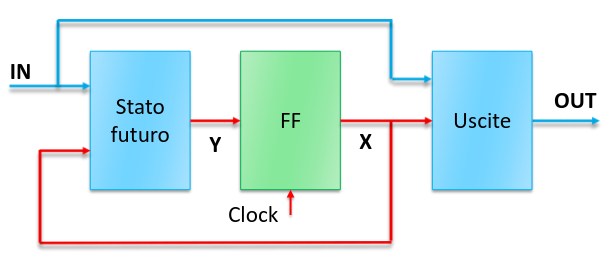
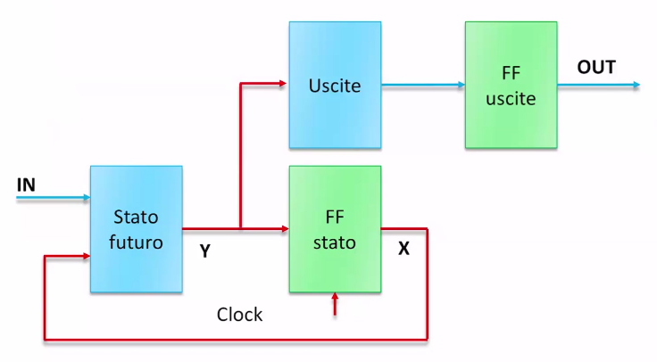

## Macchine a stati in VHDL

Per realizzare una macchina a stati in VHDL, possiamo separare la parte
sequenziale e quella combinatoria. In particolare, la prima sarà un registro a
molti bit e la seconda verrà divisa in 2 parti, una per il calcolo dello stato
futuro e l'altra per le uscite.



:::tip

In una macchina di Moore il collegamento sopra (freccia azzurra) non esiste,
perchè le uscite del circuito dipendono solo dallo stato corrente.

:::

### Derivatore

Realizziamo il derivatore, nell'implementazione come macchina di Moore.

```vhdl
library ieee;
use ieee.std_logic_1164.all;

entity derivatore is
    port (
        s, clk, res : in std_logic;
        y : out std_logic:
    );
end;

architecture behavioral of derivatore is
    -- Lo stato è un enum, in modo da non dover specificare subito la codifica.
    -- Non è sempre supportato dai sintetizzatori. Una soluzione più portatile
    -- sarebbe quella di usare costanti esplicite.
    type stato is (a, b, c, d);
    signal present_state, next_state : stato;
begin
    -- Parte sequenziale del derivatore.
    seq: process (res, clk) is
    begin
        -- Segnale di reset asincrono.
        if res = '0' then
            -- a è lo stato iniziale.
            present_state <= a;
        elsif rising_edge(clk) then
            -- Al fronte del clock lo stato futuro diventa il presente.
            present_state <= next_state;
        end;
    end;

    futuro: process (present_state, s) is
    begin
        -- Nei processi si usa case.
        case present_state is
            when a =>
                if s = '0' then
                    next_state <= a;
                else
                    next_state <= b;
                end;
            when b =>
                next_state <= c;
            when c =>
                if s = '0' then
                    next_state <= d;
                else
                    next_state <= c;
                end;
            when d =>
                next_state <= a;

            -- Se ci fossero varianti rimanenti, si userebbe `when others =>`.
        end;
    end;

    uscite: process (present_state) is
    begin
        y <= '0';

        if present_state = b or present_state = d then
            y <= '1';
        end;
    end;
end;
```

Solo `present_state` diventa un insieme di flip flop dato che ci sono casi in
cui il processo non gli assegna un valore.

## Memorie

Quando si progetta un circuito si possono usare diversi tipi di memoria:

- ROM: read-only memory;
- RAM: random-access memory;

Normalmente la memoria non viene sintetizzata (verrebbe un circuito troppo
grande). Si implementa a mano o con specifici generatori automatici.

Può essere utile però esprimere delle memorie in VHDL per eseguire le
simulazioni.

### ROM

Una memoria ROM è semplicemente un array di valori indicizzato da un integer
(indirizzo).

```vhdl
library ieee;
use ieee.std_logic_1164.all;

entity ROM is
    port (
        address : in integer range (0 to 15);
        data : out std_logic_vector(7 downto 0);
    );
end;

architecture dataflow of ROM is
    type rom_array is array(0 to 15) of std_logic_vector(7 downto 0);
    constant rom : rom_array := (
        "01010101",
        "10101010",
        -- ...
        "11111111",
        "00110011",
    );
begin
    data <= rom(address) after 10ns;
end;
```

Con una ROM si può implementare una tabella della verità. Di conseguenza
qualsiasi circuito combinatorio può essere implementato come una ROM.

### RAM

Creiamo una RAM asincrona, con i seguenti segnali:

- bus dati di tipo `inout`;
- `cs`: chip select, per segnalare che la memoria può usare il bus dati;
- `oe`: output enable, per abilitare la lettura dalla RAM;
- `we`: write enable, per abilitare la scrittura sulla RAM;

```vhdl
library ieee;
use ieee.std_logic_1164.all;

entity RAM is
    port (
        address : in integer range (0 to 15);
        data : inout std_logic_vector(7 downto 0);
        cs, oe, we : in std_logic;
    );
end;

architecture behavioral of RAM is
begin
    process (address, cs, we, oe, data) is
        type ram_array is array(0 to 15) of std_logic_vector(7 downto 0);
        variable mem : ram_array;
    begin
        data <= (others => 'Z');

        if cs = '0' then
            if oe = '0' then
                data <= mem(address);
            elsif we = '0' then
                mem(address) <= data;
            end;
        end;
    end;
end;
```

Bisogna fare attenzione a come viene pilotato l'ingresso dati, dato che esso
sarà condiviso con altre periferiche.

## Funzioni

In VHDL una funzione è uno strumento che serve solo a fattorizzare il codice.

I parametri sono solamente ingressi. È possibile ritornare un valore con la
parola chiave `return`.

Gli statement vengono eseguiti sequenzialmente, come in un processo. Ma, a
differenza di esso, essa si attiva solo quando viene chiamata, non quando cambia
il valore dei parametri in ingresso.

```vhdl
library ieee;
use ieee.std_logic_1164.all;

entity s is
    port (
        p1, q1 : in std_logic_vector(7 downto 0);
        p2, q2 : in std_logic_vector(3 downto 0);
        y1 : out std_logic_vector(7 downto 0);
        y2 : out std_logic_vector(3 downto 0);
    );
end;

architecture behavioral of s is
    function add(a, b : in std_logic_vector) return std_logic_vector is
        variable s : std_logic_vector(a'range);
        variable carry : std_logic;
    begin
        carry := '0';
        for i in a'range loop
            s(i) := a(i) xor b(i) xor carry;
            carry := (a(i) and b(i)) or (carry and a(i)) or (carry and b(i));
        end;
        return s;
    end;
begin
    y1 <= add(p1, q1);
    y2 <= add(p2, q2);
end;
```

## Procedure

Le procedure sono simili alle funzioni, ma possono ritornare più di un valore.

I parametri possono essere di tipo `in` o `out` e possono essere sia variabili
che segnali.

```vhdl
procedure somma(
    a, b : in std_logic_vector;
    y : out std_logic_vector;
    cout : out std_logic;
) is
    variable carry : std_logic;
begin
    carry <= '0';
    for i in a'range loop
        y(i) := a(i) xor b(i) xor carry;
        carry := (a(i) and b(i)) or (carry and a(i)) or (carry and b(i));
    end;
    cout := carry;
end;
```

## Uscite registrate

Nelle macchine di Moore può essere utile fare in modo che le uscite del circuito
corrispondano alle uscite di qualche flip flop. In questo modo esse si
aggiornano subito dopo il fronte del clock e non presentano glitch.

Per evitare ulteriori ritardi, è possibile calcolare il valore delle uscite a
partire dallo stato futuro.


