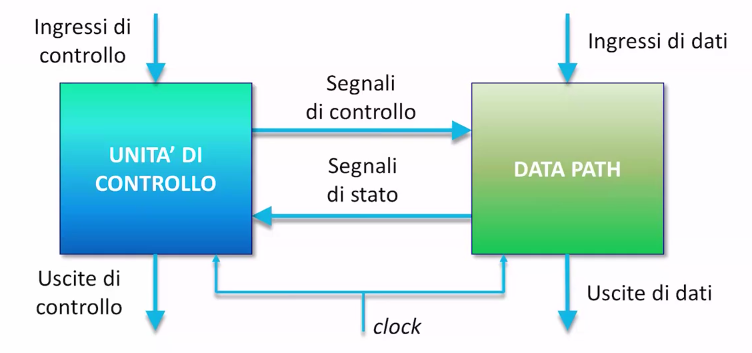

## Metodo di progetto RTL

Finora abbiamo visto come costruire diversi circuiti semplici, usando sia il
metodo gerarchico sia quello iterativo.

Il problema che rimane è quello di gestire la complessità man mano che il numero
di stati aumenta. Ricordiamo che ogni flip flop aggiunto raddoppia il numero
degli stati del circuito.

Nonostante i circuiti abbiano migliaia di stati, generalmente questi non
concorrono nella logica del funzionamento del circuito. Il flusso delle
operazioni rimane in gran parte invariato al cambiare dei valori dei registri.

Chiameremo **data path** la parte circuitale che si occupa di trattare i dati e
**unità di controllo** la parte che si occupa di gestire le operazioni secondo
un flusso logico.

### Data path

Contiene:

- la parte di calcolo, come circuiti combinatori aritmetici e logici;
- registri e contatori per memorizzare i dati;
- circuiti per spostare i dati da un registro ad un altro e dai registri ai
  circuiti combinatori;

La sua interfaccia è composta da:

- ingressi di dati;
- uscite di dati;
- segnali di controllo dei vari componenti (init, reset, multiplexer,
  configurazioni delle reti di calcolo, etc...);
- segnali di stato dei vari componenti (TC del contatore, carry e overflow,
  etc...)

### Unità di controllo

L'unità di controllo è una macchina a stati che esprime la logica di
funzionamento del circuito.

Il numero di stati è ridotto (ad esempio si memorizza solo che un contatore ha
finito di contare invece che il suo valore).

La sua interfaccia è composta da:

- ingressi di controllo (bottoni, etc...);
- uscite di controllo (spie, etc...);
- segnali di controllo del data path;
- segnali di stato del data path;

## Sistema RTL

Entrambi i blocchi sono sequenziali e sincronizzati dallo stesso clock.

## ALU

L'arithmetic logic unit è un componente che si trova spesso nel data path. Può
essere configurato tramite dei segnali di controllo per eseguire diverse
operazioni logiche o aritmetiche.

Di solito viene inserità per condividere l'hardware tra varie operazioni e
quindi risparmiare economicamente. Si diminuisce tuttavia il parallelismo del
sistema.
