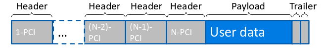

## Architettura a strati del web

La rete è una struttura complessa, formata da molti componenti, ma allo stesso
tempo deve essere estremamente flessibile.

Suddividendo la rete a strati si possono isolare delle 'mansioni' che ogni
componente deve svolgere. Inoltre la manutenzione è più semplice perchè se
cambia un componente il comportamento deve essere lo stesso e quindi c'è la
garanzia che le applicazioni continueranno a funzionare.

Ogni strato (o layer) della rete ha le seguenti proprietà:

- fornisce servizi al layer superiore;
- usa i servizi del layer inferiore;
- il layer N+1 sa solo che i layer inferiori offrono il servizio N, i layer da N
  in giù devono essere considerati una scatola nera per le entità al layer N+1;

L'interfaccia di programmazione che divide un layer dall'altro è detta **service
access point** (SAP).

Lo scambio di informazioni tra entità dello stesso layer è regolato da un
protocollo.

### Modello a 5 strati

Il modello che si usa più comunemente suddivide la rete in 5 strati:

- layer 7 '**applicazione**':
  - specifico per ogni programma che ha bisogno di scambiare dati;
  - ci sono alcuni protocolli pubblici che permettono a programmi diversi di
    collaborare (HTTP, SMTP, etc...);
  - i pacchetti di livello 7 sono chiamati '**messaggi**'
  - esempio: protocollo HTTP;
- layer 4 '**trasporto**':
  - risolve problemi di QoS del layer 3;
  - segmenta e ricompone i dati;
  - multiplexing e demultiplexing di applicazioni;
  - pacchetti di livello 4 sono chiamati '**segmenti**'
  - esempio: protocollo TCP;
- layer 3 '**rete**':
  - connette tra un host e l'altro o diversi processi sullo stesso host.
  - i pacchetti di livello 3 sono chiamati '**pacchetti**' o '**datagrammi**'
  - esempio: protocolli IP;
- layer 2 '**link**':
  - usato per comunicazioni punto-punto (ad esempio tra host e switch);
  - controlla e corregge errori di trasmissione;
  - implementa il MAC (Medium access control);
  - i pacchetti di livello 2 sono chiamati '**frame**';
  - esempio: protocolli ethernet, wlan, etc...;
- layer 1 '**fisico**':
  - trasferimento dei singoli bit sul mezzo fisico;

:::note

In questo caso si può vedere che gli strati superiori possono continuare ad
usare gli stessi protocolli irrispettivamente dal fatto che i bit viaggino su
cavo o su onde radio.

:::

### Modello OSI

Il modello OSI introduce altri 2 strati:

- layer 6 'presentazione': prima di applicazione, permette di interpretare il
  significato dei dati (cifratura, compressione, etc..);
- layer 5 'sessione': prima di presentazione, permette di recuperare dati
  salvati sull'host inerenti alla richiesta;

In realtà questi 2 strati vengono implementati a livello di applicazione visto
il numero di mansioni specifiche che possono svolgere.

### Stratificazione

Ogni messaggio che viene trasmesso attraverso il modello a strati segue un
percorso specifico attraverso gli strati;

1. l'applicazione genera il messaggio e lo invia al layer di trasporto;
2. il layer di trasporto aggiunge delle testate al messaggio e invia il tutto al
   layer successivo e così via finchè i bits non vengono trasmessi fisicamente;
3. nell'host ricevitore il messaggio compie il percorso contrario gli strati
   leggono e rimuovono le corrispettive testate e passano il messaggio al
   superiore;

### Data Units (DUs)

In un sistema con $M$ layer, i dati da trasmettere costituiscono una $M$-SDU
(service data unit di layer $M$). A ciò il layer aggiancia la propria $M$-PCI
(protocol control information). Il risultato è una $M$-PDU (protocol data unit).

Ogni layer considera la PDU del livello superiore come una busta chiusa, non può
cambiare il suo comportamento a seconda del contenuto.

Dal ricevitore si inverte il processo: ogni layer rimuove le sue PCI.

Le data unit possono essere:

- assemblate: per evitare di inviare pacchetti troppo piccoli;
- segmentate: per evitare di inviare pacchetti troppo grandi;
- ri-assemblate: processo inverso della segmentazione;
