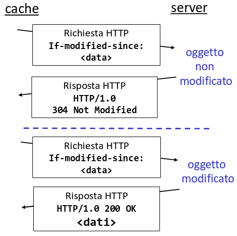

## Protocolli di trasporto internet

Oggi si usano principalmente 2 protocolli di layer 4 per trasferire i pacchetti:

- Transport Control Protocol (TCP):
  - necessità di creare una connessione tra host;
  - garantisce che l'altro host riceva i dati in maniera ordinata;
  - controllo di flusso: il destinatario specifica quanti bits il mittente può
    inviare;
  - controllo della congestione: invia meno dati quando la rete è
    sovraccaricata;
- User Datagram Protocol (UDP):
  - trasferimento di dati inaffidabile;
  - non offre alcuna garanzia sull'arrivo dei dati all'altro host;
  - utile in applicazioni che richiedono bassa latenza;

## HTTP

https://developer.mozilla.org/docs/Web/HTTP

Il protocollo HTTP è stato proposto da Tim Berners-Lee ed oggi è il protocollo
che governa la maggior parte dei trasferimenti di dati sul web.

Una pagina web è formata da un file di base in formato HTML (HyperText Markup
Language), che può includere referenze a diversi oggetti.

Ogni oggetto è referenziato da un URL (Uniform Resource Allocator).

Il protocollo HTTP si basa su un modello client-server, il client invia
richieste al server e quest'ultimo risponde. Al di sotto usa il protocollo TCP
per inviare i dati, di solito il server ascolta sulla porta 80.

HTTP è un protocollo stateless, il server non mantiene informazioni sulle
richieste fatte dal client. Se c'è bisogno di implementare sessioni è necessario
farlo al di sopra del protocollo.

:::note

Per migliorare la performance, di solito i server lasciano la connessione TCP
aperta in modo che i client possano riutilizzarla per evitare l'overhead di
apertura per ogni richiesta.

:::

### Tipologie di messaggio

HTTP è un protocollo testuale (usa caratteri ascii) e distingue tra 2 tipi di
messaggi. Ogni riga del messaggio è separata da un carriage return + line feed
(`\r\n`).

- messaggio di richiesta:

  ```
  GET /some-file HTTP/1.1
  Host: example.com
  ```

  La prima riga specifica in ordine metodo, path, e versione HTTP. Poi seguono
  una o più righe di headers in formato `header-name: header-value`.

  La fine della sezione delle headers è segnalata da una riga vuota e tutto ciò
  che viene dopo è arbitrario e rappresenta il corpo della richiesta.

- messaggio di risposta

  ```
  HTTP/1.1 200 Ok
  Content-Length: 678
  Content-Type: text/html

  <!DOCTYPE html>
  <html lang="en">
  ...
  ```

  Qua la prima riga specifica versione HTTP, codice di stato ed espressione di
  stato. Poi il resto funziona come nella richiesta.

:::tip

Il nome delle header è case insensitive, quindi non importa se si usano lettere
maiuscole o minuscole.

:::

### Metodi

https://developer.mozilla.org/docs/Web/HTTP/Reference/Methods

I metodi HTTP più usati sono:

- `GET`: richiede una risorsa dal server. Dovrebbe essere idempotent, ovvero non
  dovrebbe modificare dati sul server.
- `POST`: crea una risorsa nel server.
- `HEAD`: chiede una risposta identica a quella di un `GET`, ma senza il corpo
  di risposta.
- `PUT`: rimpiazza una risorsa sul server.
- `DELETE`: richiede al server di cancellare la risorsa specificata.

Altri che si trovano più raramente sono `CONNECT`, `OPTIONS`, `TRACE`, `PATCH`.

### Codici di stato

Esistono molti codici numerici che indicano una specifica condizione del server:

- https://developer.mozilla.org/docs/Web/HTTP/Reference/Status
- https://http.cat

### Cookies

https://developer.mozilla.org/docs/Web/HTTP/Guides/Cookies

I cookie sono un meccanismo integrato in HTTP che permette al server di
identificare un client, rendendo il protocollo meno _stateless_.

1. Quando un client fa una richiesta, il server può aggiungere alla risposta una
   o più `set-cookie` headers.
2. Il client legge il loro valore e lo conserva da qualche parte.
3. Alla richiesta successiva il client dovrebbe includere tutti i cookie inviati
   dal server nell'header `cookie`.

### Proxies e caches

Una proxy è un server a cui i client si connettono invece che passare
direttamente al server originale.

Il server di proxy può:

- filtrare richieste a siti web dannosi;
- mantenere risposte del server in cache per diminuire il carico sulla rete;

#### GET condizionale

Al giorno d'oggi i browsers tengono in memoria alcuni file, in modo da non
doverli riscaricare dal server quando la pagina viene ricaricata.

**Problema**: Come tenere queesti file aggiornati?

Esiste una particolare header HTTP che permette di eseguire l'invalidazione
della cache sul client. Quando esso invia una richiesta al server, può includere
l'header `if-modified-since`. Se l'oggetto sul server è più nuovo allora
quest'ultimo lo invierà nella risposta, altrimenti può inviare una rispossta
vuota con status code `304` (Not modified).


