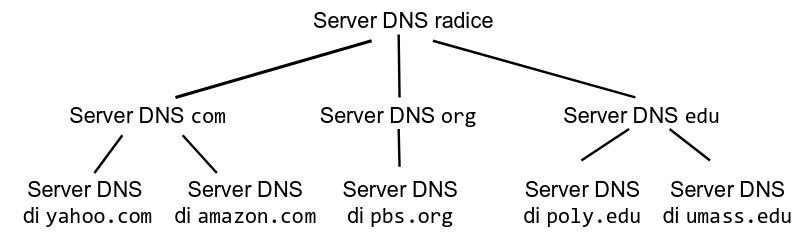
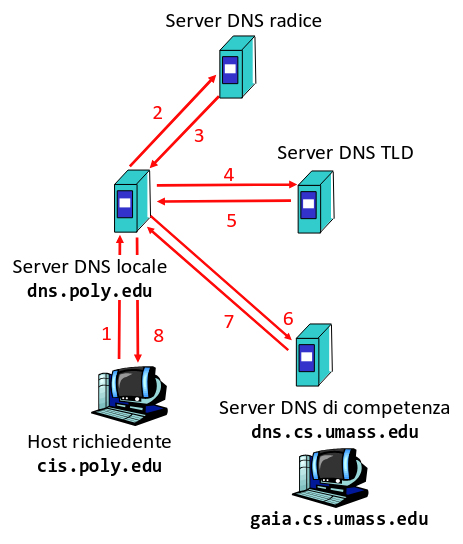
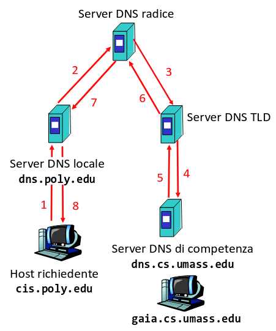

## Protocolli di accesso al server di posta locale

Servono a leggere le mail salvate sul proprio server di posta attraverso
l'agente utente.

### POP3

POP3 è (anche se oggi si usa raramente) un protocollo testuale che permette di
connettersi al server e scaricare o eliminare i messaggi salvati.

Per iniziare una connessione, il client si connette alla porta 110 del server.

Il protocollo è stateless, quindi il server non salva informazioni come la
lettura del messaggio, etc...

Il formato dei comandi è simile a quello di FTP:

- `user <user>`: invia il nome utente per l'autenticazione;
- `pass <password>`: invia la password per l'autenticazione;
- `list`: il server risponde con una lista di messaggi in formato
  `<id> <lunghezza messaggio>`;
- `retr <id>`: il server risponde con il contenuto del messaggio;
- `dele <id>`: il server elimina il messaggio;
- `quit`: chiude la connessione;

Di solito con POP3 si scaricano i messaggi e si cancellano subito dal server per
indicare la lettura. Se si vogliono preservare bisogna salvarli da qualche parte
su client.

### IMAP

IMAP è il successore di POP3 ed è il protocollo più usato ad oggi.

Tra le sue features:

- mantiene tutti i messaggi + altri metadati sul server;
- consente di organizzare i messaggi in cartelle;

Per iniziare una connessione, il client si connette alla porta 143 del server.

## TLS nei protocolli e-mail

Per garantire la sicurezza delle comunicazioni, tutti i protocolli e-mail
supportano il TLS.

È necessario connettersi ad altre porte sul server dato che esso deve aspettarsi
di ricevere dati cifrati. Di solito sono:

- 465 per SMTP;
- 995 per POP3;
- 993 per IMAP;

### StartTLS

StartTLS (a volte anche detto TLS esplicito) è un'estensione di TLS. Permette di
creare una connessione cifrata anche quando il server inizialmente non se
l'aspetta. Questo permette di rendere sicura la comunicazione anche sulle porte
originali dei protocolli.

Per sfruttare il protocollo:

1. Il client manda una richiesta in chiaro al server dove chiede solamente di
   passare al protocollo cifrato.
2. Se il server lo supporta, allora la connessione viene criptata.

:::caution

Il fatto che la connessione venga criptata non è una garanzia, ma dipende
dall'implementazione di client e server.

Quindi è preferibile usare i protocolli dove non c'è bisogno di StartTLS che
garantiscono la cifratura di ogni messaggio.

:::

Il protocollo StartTLS si usa spesso per la comunicazione tra server di un
provider ad un altro, dove si cerca di trovare il protocollo più compatibile
possibile. Per tutti gli altri usi conviene usare il TLS implicito.

## DNS

Il DNS è un servizio accessorio dell'Internet il cui scopo originale era quello
di permettere di associare un alias facile da ricordare ad un indirizzo IP.

Tra le altre cose che rende possibili:

- Alias di host: un alias può riferirsi ad un altro alias.
- Alias di server mail: un alias può indicare quale server gestisce la posta per
  un certo dominio.
- Distribuzione del carico: un alias può essere associato a più indirizzi. Il
  client può scegliere a quale inviare la richiesta.

Il DNS funziona come un database globale. Però non è centralizzato in un unico
server per diversi motivi.

### Messaggi

Il protocollo DNS è formato da 2 tipi di messaggi le richieste (**queries**) e
le risposte (**responses**), entrambi con lo stesso formato binario.

Essi includono:

- un ID a 16 bit, uguale tra domanda e risposta;
- alcuni bit per delle flag;
- altri campi indicanti il numero di domande e risposte (possono essere
  multiple);
- il resto viene usato per i resource records della query e della risposta;

### Resource records

I resource records rappresentano l'informazione scambiata con il protocollo DNS.
Sono nel formato `(name, value, type, TTL)`.

Il TTL indica per quanti secondi un record può essere salvato in cache prima di
essere nuovamente risolto.

Il tipi di resource record più comuni sono:

- `A`/`AAAA`: associazione tra hostname (name) e indirizzo IPv4/IPv6 (value);
- `CNAME`: crea un alias (name) per qualche altro hostname (value)
- `NS`: indica qual'è il nome (value) del server di competenza per un certo host
  (name);
- `MX`: indica qual'è il nome (value) del server di posta per un dominio (name);

### Gerarchia dei server DNS

Di base, ogni server nell'albero si occupa di risolvere (trovare l'indirizzo IP
associato) una porzione del dominio (separate dal `.`) partendo da destra.

Quando un client cerca l'IP `www.example.com`:

1. Il client chiede al root server qual'è il server DNS del dominio `.com`;
2. Il client chiede al server di `.com` qual'è il server DNS di `.example.com`;
3. Il client chiede al server di `.example.com` qual'è l'indirizzo associato a
   `www.example.com`;

#### Server di competenza (authoritative server)

Il server di competenza per un certo dominio è il server dove l'organizzazione
che detiene il dominio pubblica i suoi record DNS. Ovviamente può essere
replicato.

Tutti i server che appartengono strettamente alla gerarchia sono autoritativi.

### Server locale

Di solito non ci si connette direttamente ai root server, molti ISP e cloud
providers provvedono dei server DNS che funzionano in modalità proxy.

Questo permette di alleggerire di molto il carico perché ogni richiesta può
essere salvata in una cache.

### Queries iterative e ricorsive

A seconda di un flag, una query può essere eseguita in 2 modi:

- **Iterativo**: il server locale si occupa di contattare ogni server DNS finché
  non avviene la risoluzione.

  

- **Ricorsivo**: il server locale invia la richiesta al root server, che si
  occupa di risolverla.

  Dato che la risposta passa attraverso ogni server, essi possono memorizzarla
  in modo da velocizzare la risoluzione la volta dopo. Occorre però un
  meccanismo per invalidare questa cache.

  
