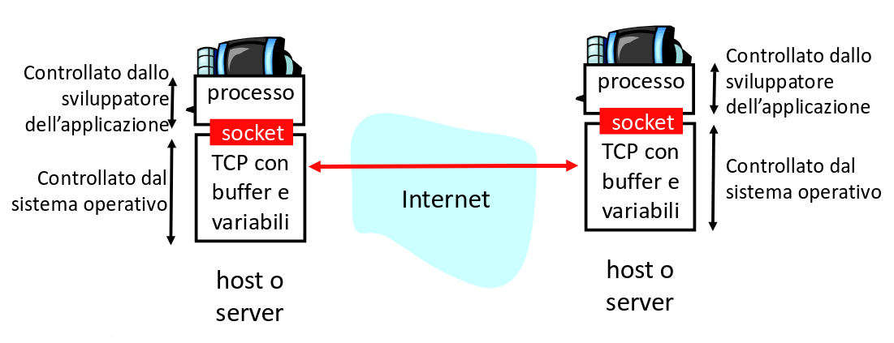
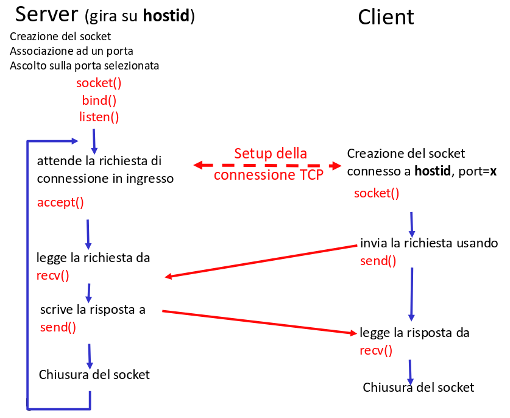

## Socket

La socket è l'interfaccia di programmazione usata dalle applicazioni per inviare
dati al livello di trasporto. Di solito separa anche l'userspace dal sistema
operativo.

Per effettuare un trasferimento di dati:

1. il server (host ricevente) deve aprire una socket e iniziare ad ascoltare;
2. il client (host trasmittente) inizia la connessione;
3. il server accetta la richiesta e può rispondere;

## Livello di trasporto

I protocolli del livello di trasporto si occupano della comunicazione logica tra
i processi su 2 host differenti.

L'host inviante divide i messaggi in segmenti e li passa al livello di rete,
quello ricevente ricompone i messaggi e li passa al livello applicazione.

I principali protocolli usati sono 2:

- TCP: affidabile, garantisce la consegna ordinata dei pacchetti;
- UDP: best effort;

Questo layer non offre nessuna garanzia sul ritardo e sull'ampiezza di banda
della rete.

### Multiplexing/demultiplexing

Il trasmettitore effettua il multiplexing, ovvero divide i dati di diverse
socket e aggiunge le header della PCI.

Il ricevitore invece effettua il demultiplexing, ovvero leggendo la PCI,
indirizza i dati ricevuti alle diverse socket in ascolto.

### Porte TCP e UDP

La destinazione finale di un segmento non è un host, ma un processo su
quell'host.

L'interfaccia tra l'applicazione e il livello di trasporto è la **porta**,
identificata da un numero a 16 bit.

Generalmente, le porte di sorgente e destinazione sono diverse:

- Solo la porta in ascolto sull'host ricevente deve avere un numero conosciuto
  (e quindi di solito a poche cifre), poi per rispondere aprirà un altra socket
  con numero di porta casuale.
- Il trasmettitore invece può aprire più connessioni in parallelo e che devono
  partire da porte diverse (per questo si assegna un numero casuale più cifre in
  modo da evitare conflitti).

## UDP

UDP è il servizio di trasporto più semplice. Ogni segmento può andare perso o
essere consegnato fuori sequenza.

I vantaggi sono:

- è un protocollo stateless (meno risorse richieste);
- non richiede di stabilire una connessione (meno ritardi);
- ha delle testate più piccole (meno dati trasmessi);

Un segmento UDP è composto da 4 sezioni di testata + i dati dell'applicazione.

| Sezione                             | Lunghezza in bit |
| ----------------------------------- | ---------------- |
| porta sorgente                      | 16               |
| porta destinazione                  | 16               |
| lunghezza segmento (inclusa header) | 16               |
| checksum                            | 16               |
| dati applicazione                   | ?                |

### Checksum UDP

Il protocollo UDP non offre alcuna garanzia sull'arrivo del segmento alla
destinazione, tantomeno che esso arrivi in maniera ordinata rispetto agli altri.

C'è però un meccanismo che permette di verificare che i bit all'interno del
singolo segmento non siano stati alterati.

Il mittente tratta il contenuto del segmento come una sequenza di interi a 16
bit. Esso somma questi interi e ne calcola il complemento a 1. Questo valore è
posto nel campo checksum della testata.

Il ricevente somma gli interi del contenuto al checksum. Il risultato dovrebbe
essere il numero `0b1111111111111111`.
