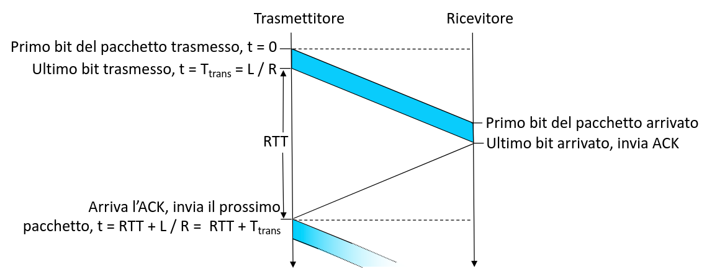
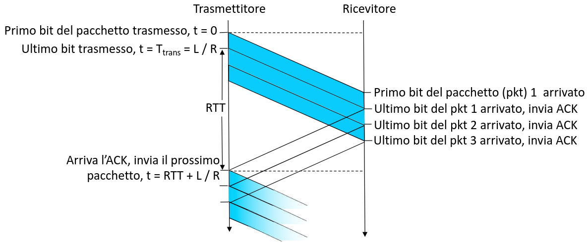

## Protocolli ARQ

I protocolli ARQ (Automatic Repeat reQuest) sono una classe di protocolli che
cerca di recuperare gli errori di trasmissione dei pacchetti.

Per notificare il trasmettitore di una corretta trasmissione si usano speciali
pacchetti, comunemente detti ACK (acknowledgments).

I più rilevanti protocolli di questo tipo sono:

- Stop-and-Wait;
- Go-back-N;
- Selective Repeat;
- TCP;

### Stop-and-Wait

In questo protocollo, il trasmettitore invia una PDU, ma ne conserva anche una
copia locale con un timeout fissato. Poi attende la ricezione del rispettivo ACK
e, in sua mancanza, invia di nuovo il pacchetto quando scade il timeout.

Il ricevitore genera il checksum dei dati e controlla il numero di sequenza, se
non corrispondono a quelli inviati allora il pacchetto viene droppato.
Altrimenti invia l'ACK.

Alla ricezione dell'ACK vengono di nuovo controllati il checksum e il numero di
sequenza.

Il protocollo è molto inefficiente perchè assumerebbe che il tempo di ricezione
dell'ACK sia trascurabile. Nella realtà, per ogni invio di pacchetto bisogna
aspettare il doppio del ritardo di propagazione prima di poterne inviare
un'altro.

### Protocolli con pipelining

Il pipelining, consisten nell'invio di multipli pacchetti prima che sia stato
ricevuto l'ACK dei precedenti.

Il pipelining aumenta l'efficienza del protocollo di un fattore pari alla
grandezza del buffer dei pacchetti inviati (anche detto **finestra**), perchè si
riesce a limitare la perdita di tempo dovuta al round trip time tra
client-server (dati) e server-client (ACK).

Di seguito definiamo alcuni nomi che vengono usati in maniera standard:

- finestra di trasmissione ($W_T$): numero di PDU che il trasmettitore può
  inviare senza aver ricevuto l'ACK della precedente;
- finestra di ricezione ($W_R$): numero di PDU che il ricevitore può accettare
  prima di processarle;
- puntatore low ($W_\text{LOW}$): puntatore al primo pacchetto della finestra di
  trasmissione (quello inviato prima cronologicamente );
- puntatore up ($W_\text{UP}$): puntatore all'ultimo pacchetto già trasmesso
  (che potrebbe non coincidere coincidere con l'ultimo pacchetto in $W_T$)

A seconda del protocollo usato, si possono usare diversi tipi di ACK:

- ACK individuale: indica la ricezione di un pacchetto specifico;
- ACK cumulativo: indica la ricezione fino ad un certo pacchetto;
- ACK negativo (NACK): indica un errore di trasmissione per un singolo
  pacchetto;
- piggybacking: inserimento di un ACK in un pacchetto di dati (utile se il
  server deve comunque inviare risposte);

#### Go-back-N

Go-back-N funziona con gli ACK comulativi, quando il timer del pacchetto
$W_\text{LOW}$ scade, il trasmettirore re-invia tutti i pacchetti senza ACK.

#### Selective Repeat

Selective Repeat invece usa ACK individuali. Il timer viene mantenuto per ogni
pacchetto non ancora ricevuto e allo scadere si re-invia solo il pacchetto con
errori.

In Selective Repeat, i numeri di sequenza hanno un andamento ciclico, con
periodo definito dalle dimensioni delle finestre di trasmissione e ricezione. In
generale $|W_T| + |W_R| \leq 2^k$, dove $2^k$ è il numero massimo di pacchetti.

In pratica, se succede che vengono consegnati correttamente tutti i pacchetti,
ma vengono persi tutti gli ACK, $W_T$ e $W_R$ devono rimanere al massimo
contigue, senza mai sovrapporsi.
