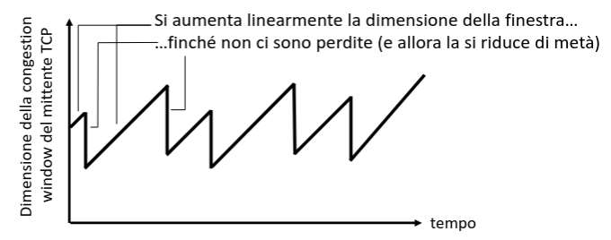
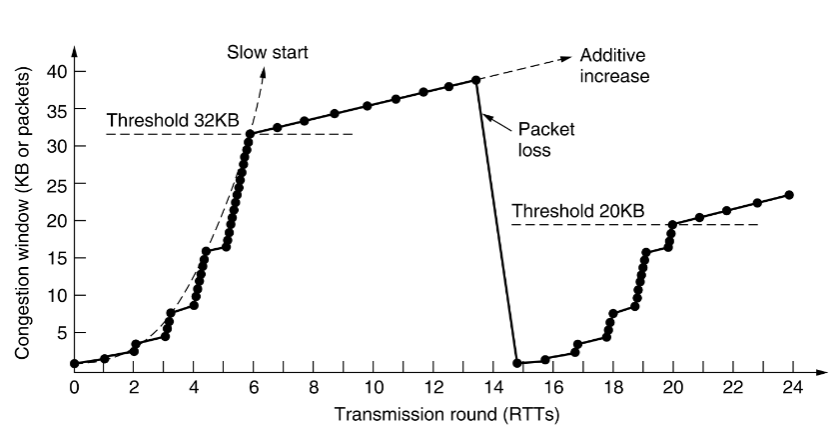
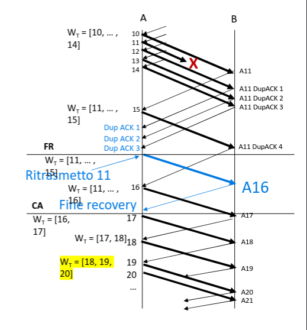

## Principi del controllo di congestione

In generale si definisce una congestione la situazione in cui troppi
trasmettitori stanno inviando troppi dati e la rete non riesce a gestire il
traffico.

Le conseguenze di una rete congestionata sono pacchetti persi e lunghi ritardi
di accodamento.

Congestione e controllo di flusso sono 2 cose diverse. Una dipende dalle
condizioni di tutta la rete, l'altro solamente dalla velocità di lettura
dell'host ricevente.

Le cause si possono riassumere in 3 gruppi:

- tasso di arrivo dei pacchetti = tasso di invio: comporta ritardi di
  accodamento molto elevati, che tendono ad infinito (assumendo buffer
  infiniti).
- ritrasmissione di pacchetti non necessaria: i ritardi di accodamento fanno
  scadere un timeout sul mittente, che credendo che il pacchetto sia stato
  perso, lo ritrasmette.
- ritrasmissione di pacchetti scartati: quando i pacchetti vengono
  effettivamente scartati, è necessario re-inviarli, la rete viene congestionata
  da pacchetti che stanno rifacendo lo stesso percorso di quelli scartati.

### Controllo di congestione in TCP

Il TCP è un protocollo che si adatta alle situazioni di congestione sulla rete
per:

- adattare il tasso di trasmissione alle condizioni correnti;
- evitare di saturare la rete con inutili ritrasmissioni;

Non c'è un solo algoritmo per gestire queste situazioni e l'implementazione
spesso dipende dal sistema operativo.

- controllo di congestione end-to-end: il client capisce le condizioni di rete
  valutando il numero di pacchetti persi e i ritardi.
- controllo di congestione assistito dalla rete: i router forniscono feedback
  agli host sul loro stato (implementato più raramente che il metodo
  end-to-end).

### Additive Increase Multiplicative Decrease (AIMD)

Con il metodo AIMD, il mittente aumenta il tasso di trasmissione (dimensione
della finestra) cercando di occupare tutta la banda disponibile, fino a quando
non si rilevano perdite.

- additive increase: aumenta linearmente la finestra di un MSS ad ogni RTT;
- multiplicative decrease: dimezza (di solito) le dimensioni della finestra;



L'algoritmo AIMD permette anche a 2 host di condividere equamente la stessa
quantità di banda: l'host che ne stava usando di più viene penalizzato
maggiormente dal multiplicative decrease.

### Finestra di congestione

Il controllo di congestione gestisce l'adattamento della finestra di congestione
($\text{CWND}$).

A prescindere dall'algoritmo usato:

$$
W_T = min(\text{CWND}, W_R)
$$

:::tip

Ricordiamo che $W_T$ è la finestra di trasmissione e $W_R$ quella di ricezione.

:::

## TCP slow start e congestion avoidance

La fase iniziale dell'algoritmo è detta **slow start** ed è caratterizzata da un
aumento esponenziale della $\text{CWND}$.

- si inizia con $\text{CWND = MSS}$;
- per ogni ACK valido ricevuto: aumento $\text{CWMD}$ di $1\ \text{MSS}$;
- quando viene raggiunta una certa soglia ($\text{SSTHRESH}$) si passa alla fase
  di congestion avoidance.

Il **congestion avoidance** è la parte di in cui la $\text{CWND}$ aumenta
linearmente di $\frac{\text{MSS}^2}{\text{CWND}}$. Quindi per ogni RTT in cui
ricevo tutti gli ACK attesi, aumento $\text{CWND}$ di un $1\ \text{MSS}$.

### Slow start

```lua
cwnd = mss
ssthresh = get_initial_rwnd() -- (o rwnd / 2 in alcune implementazioni)
w_low = 0
rto = get_initial_rto()

-- Funzione chiamata quando viene ricevuta una risposta con gli ACK per tutti i
-- pacchetti inviati.
-- @param acks: Numero di ACK ricevuti nella risposta.
function slow_start_valid_receive(acks)
  cwnd += acks * mss -- Aumento CWND esponenzialmente.
  w_low += acks -- Sposto w_low sul primo segmento non ACKato.

  if (cwnd >= ssthresh) then
    congestion_avoidance()
  end

  -- Trasmetto il prossimo segmento.
  transmit_data(w_low)
end

-- Funzione chiamata quando non viene ricevuto l'ACK di un pacchetto inviato nel
-- tempo RTO.
function slow_start_timeout()
  ssthresh = math.max(cwnd / 2, 2) -- Si dimezza la soglia per entrare in congestion avoidance.
  rto *= 2 -- Raddoppio il RTO.
  cwnd = mss -- Resetto la dimensione della CWND.

  -- Ritrasmetto il segmento andato in timeout.
  transmit_data(w_low)
end
```

### Congestion avoidance

```lua
function congestion_avoidance_valid_receive(acks)
  cwnd += math.pow(mss, 2) / cwnd -- CWND aumenta di un valore costante.
  w_low += acks -- Sposto w_low sul primo segmento non ACKato.


  transmit_data(w_low)
end

function congestion_avoidance_timeout()
  sshtresh = math.max(cwnd / 2, 2)
  rto *= 2
  cwnd = mss

  -- Ritorno in modalita slow start e ritrasmetto i dati persi.
  slow_start()
end
```



### Fast retransmit e fast recovery

https://superuser.com/a/267765

Quando un ricevitore che supporta TCP fast retransmit riceve segmenti con un SN
maggiore di quello atteso, assume che i segmenti intermedi mancanti siano stati
persi. In questo caso esso comincia ad inviare ACKs con il numero del segmento
mancante per ogni segmento successivo ricevuto.

Gli ACK duplicati ci indicano che la rete funziona, quindi si può continuare a
trasmettere. Alla ricezione del 3° ACK duplicato, ritrasmetto il segmento
indicato da esso (fast retransmit) ed entro nella fase di fast recovery.

Nella fase di fast recovery:

- imposto il valore iniziale di $\text{RECOVER}$ al valore di $W_\text{up}$
  (quindi al primo segmento per cui stiamo ricevendo ACKs duplicati);
- $\text{SSTHRESH} = \frac{\text{CWND}}{2}$;
- $\text{CWND} = \text{SSTHRESH} + 3\ \text{MSS}$;
- invio il segmento perso:
- se arrivano altri ACK duplicati:
  - $\text{CWND} = \text{CWND} + 1 \text{MSS}$;
- se arriva un ACK che include $\text{RECOVER}$:
  - $\text{CWND} = \text{SSHTRESH}$;
  - passo a congestion avoidance;
  - sposto $W_\text{low}$ al primo segmento non ACKato
- se arriva un ACK precedente a $\text{RECOVER}$:
  - ritrasmetto il primo segmento per cui non ho un ACK;
  - $\text{CWND} = \text{CWND} - \text{numero di segmenti ACKati} + 1$;
  - sposto $W_\text{low}$ al primo segmento non ACKato;




