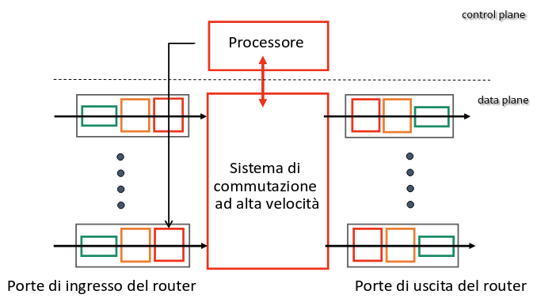
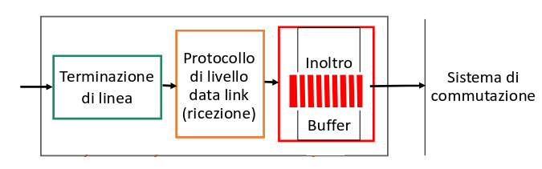
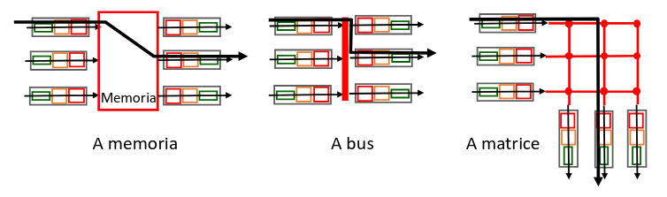

## IPv6

IPv6 è una nuova versione del protocollo IP, pensata per ampliare la quantità di
indirizzi disponibili.

Sono state fatte anche alcune modifiche che permettono di processare i
datagrammi più velocemente:

- header con lunghezza fissata a 40 byte;
- rimozione della possibilità di frammentare i pacchetti;
- rimozione del checksum;
- rimozione del campo options;

Sono inoltre stati aggiunti dei nuovi messaggi di errore su ICMPv6.

### Header IPv6

| sezione                                                        | lunghezza in bit |
| -------------------------------------------------------------- | ---------------- |
| versione (costante 6)                                          | 4                |
| priority (priorità tra datagrammi dello stesso flusso)         | 8                |
| flow label (uguale per tutti i datagrammi nello stesso flusso) | 20               |
| payload length                                                 | 16               |
| next header (identifica il protocollo L4 incapsulato)          | 8                |
| hop limit (come TTL su IPv4)                                   | 8                |
| source address                                                 | 128              |
| destination address                                            | 128              |

### Transizione tra IPv4 e IPv6

Non tutti i router su internet supportano IPv6. Come si può far coesistere reti
IPv4 e IPv6 fino a quando non finirà la transizione?

I router che supportano tunneling sono in grado di incapsulare datagrammi IPv6
all'interno di quelli IPv4. Poi un altro router dovrà estrarre questi dati e
reinstradarli quando IPv6 torna disponibile.

### Indirizzi IPv6

Gli indirizzi IPv6 sono lunghi 128 bit e a differenza di quelli IPv4 si scrivono
in notazione esadecimale.

Le cifre si scrivono in gruppi da 4. Quando ci sono degli 0 concatenati si può
accorciare e scrivere soltanto il primo. Per la sequenza di 0 più lunga si può
usare una notazione speciale '::':

- `2a03:2880:f108:0083:face:b00c:0000:25de -> 2a03:2880:f108:83:face:b00c:0:25de`;
- `2a03:2880:f108:0000:0000:0000:0000:25de -> 2a03:2880:f108::25de`;

I prefissi e le sottoreti funzionano come in IPv4, con la stessa notazione di
netmask.

#### Indirizzi speciali

- `::/128` corrisponde a `0.0.0.0`;
- loopback: `::1/128` corrisponde a `127.0.0.1`;
- IPv4 in IPv6: `::ffff:c1af:3710` corrisponde a `193.175.55.16`;
- multicast: `ff00::/8` corrisponde a `224.0.0.0/4`;
- link-local: `fe80::/10` corrisponde a `169.254.0.0/16`;

## Routing

Supponiamo che un host $A$ voglia inviare un datagramma IP ad un altro host $B$,
su una rete separata e separati da un router $R$.

1. $A$ crea il datagramma e ottiene l'indirizzo MAC di $R$ attraverso ARP;
2. $A$ invia il datagramma incapsulato in un frame di livello 2 al router;
3. $R$ riceve il frame, estrae il datagramma e lo incapsula di nuovo, inviandolo
   all'indirizzo MAC di $B$;

La risposta di $B$ seguirà lo stesso percorso al contrario.

## Architettura di un router

In generale un router si può dividere in 2 sezioni:

- control plane: implementato in software, si occupa della risoluzione della
  route migliore;
- data plane: implementato come hardware specifico, si occupa dell'inoltro dei
  dati;



### Porte d'ingresso

Ogni singola porta di ingresso si occupa della ricezione dei bit e del
buffering. Inoltre ogni porta consulta la tabella di inoltro per trovare la
porta d'uscita corretta.



Le porte d'uscita sono composte alla stessa maniera, solamente con l'ordine dei
componenti invertito.

### Sistema di commutazione

Il sistema di commutazione si occupa di trasferire i pacchetti dalla porta di
ingresso a quella d'uscita. Il tasso di commutazione è la velocità alla quale i
pacchetti vengono trasferiti. Di solito è un numero multiplo della velocità
supportata su ogni ingresso.



- **Commutazione a memoria**: è il sistema più semplice, supportato da qualsiasi
  computer dato che tutto il processo è svolto dalla CPU.
- **Commutazione a bus**: c'è un unico bus dati condiviso all'interno del
  router. La velocità di commutazione è limitata dalla banda del bus.
- **Commutazione a matrice**: gli ingressi e le uscite sono collegati da una
  matrice di connessioni. Si possono superare i limiti di velocità del sistema a
  bus.

Un commutatore più lento della velocità complessiva delle porte d'ingresso causa
accodamenti e perdita di pacchetti se i buffer vanno in overflow.

### Memoria necessaria nei buffer di un router

Con $N$ flussi di dati e con velocità dei link $C$, la memoria raccomandata è:

$$
\frac{\text{RTT}\ C}{\sqrt{N}}
$$

## Protocolli di instradamento

Finora abbiamo visto routers dove la tabella di inoltro era già configurata. Ora
vediamo come essa viene creata in maniera automatica.

Un protocollo di routing deve trovare il miglior percorso da compiere per
collegare 2 host attraverso una rete di router. La metrica che definisce il
percorso migliore è solitamente il costo (economico) minore, oppura la velocità
più alta o la minor congestione.

### Algoritmi di routing

Gli algoritmi di routing possono essere classificati in 2 maniere:

- rispetto al tipo di informazioni che un router conosce:
  - globali: il router conosce tutta la topologia della rete, si usa negli
    algoritmi _link state_;
  - distribuite: il router conosce solo gli altri router a cui è direttamente
    collegato, si usa negli algoritmi _distance vector_;
- rispetto alla velocità di cambiamento dei percorsi:
  - statici: il percorso non cambia;
  - dinamici: il percorso cambia periodicamente, solitamente a causa del cambio
    dei costi nei link;

### Algoritmo di Dijkstra

L'algoritmo di Dijkstra è un algoritmo iterativo (dopo $k$ iterazioni si conosce
il percorso a costo minimo verso $k$ destinazioni) che assume che i nodi
conoscano tutta la tipologia di rete (le informazioni sullo stato circolano in
broadcast).

Dati:

- `N`: insieme di tutti i nodi;
- `c(x, y)`: costo del link tra 2 nodi;
- `D(v)`: costo del percorso verso il nodo `v`;
- `p(v)`: predecessore di `v` lungo il cammino;
- `N'`: insieme di nodi per cui il costo minimo è stato già determinato;

```
N' = { u };

for v in N:
  if (v adiacente a u):
    D(v) = c(u, v);
    p(v) = u;
  else:
    D(v) = \infty;

while N' != N:
  trova w not in N' con D(w) minimo;
  aggiungi w a N';

  if (D(w) + c(w, v) < D(v)):
    D(v) = D(w) + c(w, v);
    p(v) = w;
```

L'algoritmo ha una complessità $O(n\ \fLog{n})$. Inoltre esso può oscillare tra
2 nodi se i costi sono definiti male, rendendo l'esecuzione interminabile.

## Autonomous Systems

Internet è formata da moltissime sottoreti, ognuna appartenente a qualche
entità. Idealmente ciascuna di esse dovrebbe essere autonoma e capace di
collegarsi a tutte le altre.

Un gruppo di router sotto lo stesso controllo amministrativo è detto
**Autonomous System** (AS). Ogni AS è identificato da un numero (ASN), assegnato
centralmente dall'ICANN.

Si formano quindi 2 tipologie di routing:

- intra-AS: dove si conoscono e si ha il controllo su tutti i routers;
- inter-AS: dove bisogna interfacciarsi con sistemi sconosciuti;

### Open Shortest Path First

OSPF è un protocollo di routing link-state intra-AS. Sfrutta l'algoritmo di
Dijkstra per calcolare il percorso migliore.

Le informazioni sullo stato della rete sono inviati attraverso multicast
all'indirizzo `224.0.0.5`. Esse viaggiano su datagrammi IP, senza nessun livello
di trasporto.

Si distinguono 3 procedure:

- _hello_: i router li scambiano periodicamente con i vicini per segnalare che
  sono attivi;
- _exchange_: scambiati tra vicini appena entrati in rete per informarli della
  tipologia di rete attuale;
- _flooding_: informa tutti i router di cambi nello stato dei link;

#### OSPF gerarchico

L'OSPF gerarchico è usato in reti con molti routers. Di solito si usa una
gerarchia a 2 livelli con backbone e reti di area locale.

I messaggi con il link state circolano solo nelle sottoreti, e tutti i router
conoscono solo uno shortest path verso le altre aree.

Solo i router di backbone si connettono ad altri AS tramite BGP.

### Problemi dei protocolli link state

L'unica cosa che influenza la scelta dei percorsi è il costo di un link. Quindi
un operatore potrebbe agire sui propri link per controllare il traffico che
passa per la loro rete.

Quindi diventa possibile per un AS fare traffic engineering, anche
prioritizzando certi vicini rispetto ad altri.
