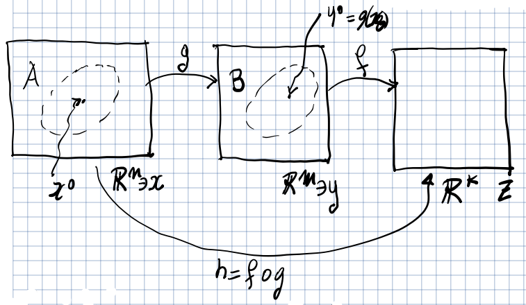

# Teorema del valore medio in $n$ variabili

Data $f: A \subseteq \R^{2} \to \R$ e

- $\exists\ p, q \in A \mid [p,q] = \Set{t\ q + (1 - t)\ p, t \in [0,1]} \subset A$
- $f$ è continua in $[p, q]$ e differenziabile in $(p, q)$.

Allora esiste un punto $c \in (p, q)$ tale che:

$$
f(q) - f(p) = \nabla f(c) \cdot (q - p)
$$

L'intervallo che si considera è dato dai punti che si trovano sul segmento che
collega il punto $p$ al punto $q$.

**Corollario**: se $\forall\ p \in B(p_{0}, r_{0}),\ \nabla f(p) = \mathbf{0}$,
allora $\forall\ p \in B(p_{0}, r_{0}),\ f(p) = f(p_{0})$. Quando $f$ è
costante, il gradiente è il vettore nullo.

# Derivate parziali di una funzione composta di più variabili (regola della catena)

:::note

La regola della catena per una funzione di 1 variabile
$h(x) = (f \circ g)(x) = f(g(x))$ è definita: $h'(x) = f'(g(x))\ g'(x)$

:::

Prima di arrivare alla formula generale per derivare una funzione composta è
necessario introdurre alcuni casi particolari:

## 1° caso

Consideriamo $g: I \subseteq \R \to \R^{2}$ e $g(t) = (g_{1}(t), g_{2}(t))$ dove
$g_{1},g_{2}: I \to \R$. Supponiamo che
$\exists\ g_{1}'(t_{0}), g_{2}'(t_{0}) $ e $g(I) \subseteq A \subseteq \R^{2}$.

Sia $f: A \subseteq \R^{2} \to \R$ e supponiamo che $f$ sia differenziabile in
$p_{0} = (x_{0}, y_{0}) = g(t_{0}) = (g_{1}(t_{0}), g_{2}(t_{0}))$.

Si può creare la funzione composta $h: I \subseteq \R \to \R$ e
$h(t) = (f \circ g)(t) = f(g(t))$. In questo caso vale il seguente teorema:

$$
\exists\ h'(t_{0}) = \frac{\partial f}{\partial x}(p_{0})\ g_{1}'(t_{0}) + \frac{\partial f}{\partial y}(p_{0})\ g_{2}'(t_{0})
$$

Oppure, tramite il prodotto tra 2 matrici con
$g'(t_{0}) = (g_{1}'(t_{0}), g_{2}'(t_{0}))$:

$$
h'(t_{0}) = \begin{bmatrix}  \frac{\partial f}{\partial x}(p_{0}) &  \frac{\partial f}{\partial y}(p_{0}) \end{bmatrix}\ \begin{bmatrix} g_{1}'(t_{0}) \\[5pt] g_{2}'(t_{0}) \end{bmatrix} = \nabla f(p_{0}) \cdot g'(t_{0})
$$

### Regola classica della catena (definita da Leibniz)

## 2° caso

TODO

## Caso generale

Vogliamo trovare la derivata di una funzione composta con un numero arbitrario
di variabili in partenza e in arrivo.

### **Matrice Jacobiana**

Sia $f: A \subseteq \R^{n} \to \R^{m}$, con $x=(x_{1}, \ldots, x_{n})$ e
$f(x) = (f_{1}(x), \ldots, f_{m}(x))$, $f_{i}: A \to \R$.

Dato $x_{0} \mid \forall\ i = 1,\ldots,m,\ \exists\ \nabla f_{i}(x_{0})$. La
matrice Jacobiana è una matrice $m \times n$ dove la riga $i$-esima coincide con
$\nabla f_{i}(x_{0})$:

$$
\begin{bmatrix}
\frac{\partial f_{1}}{\partial x_{1}} & \ldots & \frac{\partial f_{1}}{\partial x_{n}} \\
\vdots & & \vdots \\
\frac{\partial f_{m}}{\partial x_{1}} & \ldots & \frac{\partial f_{m}}{\partial x_{n}}
\end{bmatrix}
$$

:::note

La nozione di matrice Jacobiana generalizza la nozione di vettore gradiente per
funzioni scalari. Infatti ponendo $m = 1$ si ottiene il vettore del gradiente.

:::

### Regola generale della catena

Con la regola della catena è possibile trovare tutte le derivate parziali di una
funzione composta. Serve solo trovare le derivate parziali delle funzioni di
partenza.

Siano $g: A \subseteq \R^{n} \to \R^{m}$, $f: B \subseteq \R^{m} \to \R^{k}$ e
supponiamo che $g(A) \subseteq B$.

Inoltre supponiamo che, dato un punto $x_{0} \in A$:

- $g(x) = (g_{1}(x),\ldots, g_{m}(x))$, $g_{i}: A \to \R$ differenziabili in
  $x_{0}$.
- $f(x) = (f_{1}(x), \ldots, f_{k}(x))$, $f_{i}: B \to \R$ differenziabili in
  $y_{0} = g(x_{0})$.

Consideriamo ora la funzione composta $h: \R^{n} \to \R^{k}$,
$h(x) = (f \circ g)(x)$, con $h(x) = (h_{1}(x), \ldots, h_{k}(x))$,
$h_{i}: \R^{n} \to \R$ allora le funzioni $h_{1}, \ldots, h_{k}$ sono
differenziabili in $x_{0}$ e la matrice Jacobiana di $h$ è data dal prodotto
delle matrici Jacobiane delle funzioni di partenza.

$$
D_{h}(x_{0}) = D_{f}(g(x_{0}))\ D_{g}(x_{0})
$$

:::note

Si noti la somiglianza con la regola della catena ideata da Leibniz.

:::
