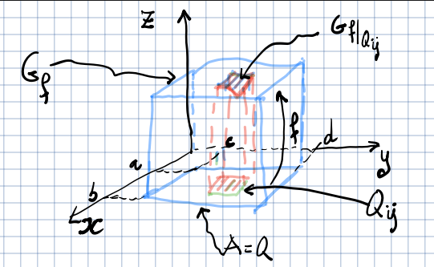

# Integrale per funzioni di più variabili

Tratteremo integrali di funzioni $f: A \subseteq \R^{n} \to \R (n = 2,3)$, detti
anche integrali multipli.

## Caso 1: integrale doppio su un rettangolo

Prendo un rettangolo $Q = [a,b] \times [c,d]$ e sia $f: A \to \R$ limitata,
ovvero esiste $\sup_{Q} f$.

$T_{f}(Q)$: solido di $\R^{3}$ sotteso dal grafico di $f$.

$$
L = \iint_{A} f(x,y)\ dx dy
$$

$L$ è detto integrale doppio di $f$ su $A$ e rappresenta il volume del solido
sotteso al grafico di $f$.

### Suddivisione di un intervallo

Si chiama suddivisione dell'intervallo $[a,b]$ un insieme finito della retta
reale $\Set{x_0, x_1, \ldots, x_{n-1}, x_n}$ tale che
$a = x_{0} < x_1 < x_n = b$:

Una suddivisione di un insieme di $\R^{2}$ è data dalla coppia $(D_{1}, D_{2})$
dove $D_{1}$ e $D_{2}$ sono suddivisioni degli intervalli sui rispettivi assi
del piano.

Il piano risulta diviso in rettangoli:

### Somme superiori e inferiori

SI chiama somma superiore (o rispettivamente inferiore) di $f$ rispetto alla
suddivisione $D$ di $Q$, il numero reale:

$$
S(f,D) = \sum_{i = 1}^{m} \sum_{j = 1}^{n} M_{ij}\ area(Q_{ij})
$$

(per le somme inferiori):

$$
s(f, D) = \sum_{i=1}^{m} \sum_{j=1}^{n} m_{ij}\ area(Q_{ij})
$$

Essendo $f$ limitata, $M_{ij}$ e $m_{ij}$ sono numeri reali (non infiniti) che
corrispondono rispettivamente all'estremo superiore e inferiore di f all'interno
della suddivisione.

#### Proprietà

- Se $f \geq 0$ allora le somme superiori e inferiori rappresentano il volume di
  un parallelepipedo di base $Q_{ij}$ e altezza $M_{ij}$ o $m_{ij}$.
- Per ogni suddivisione $D$ di $Q$:

  $$
  area(Q)\ \inf_{Q} f \leq s(f,D) \leq S(f,D) \leq area(Q)\ \sup_{Q} f
  $$

### Funzione integrabile

Una funzione $f$ si dice integrabile secondo Riemann in $Q$ ($f \in R(Q)$) se:

$$
L = \sup \Set{s(f,D)} = \inf \Set{S(f,D)}
$$

ovvero se le somme superiori e inferiori coincidono.

Il numero reale $L$ si chiama integrale doppio di $f$ e si denota:

$$
L = \iint_{Q} f(x,y)\ dx dy = \iint_{Q} f = \int_{Q} f
$$

### Condizioni che assicurino $f \in R(Q)$

- Se $f \in C^{0}([a,b])$, allora $f \in R([a,b])$.
- Se $f: [a,b] \to \R$ è monotona, allora $f \in R([a,b])$.

:::note

Un esempio di funzione dove l'integrale non esiste è una funzione con un numero
non finito di discontinuità.

:::

### Proprietà dell'integrale

- linearità: $\iint \alpha\ f + \beta\ g = \alpha \iint f + \beta \iint g$
- monotonia: se $g \leq f$ su $Q$, allora $\iint_{Q} g \leq \iint_{Q} f$
- se $|f| \in R(Q)$, allora $|\iint_{Q} f| \leq \iint_{Q} |f|$
- teorema della media:
  $\inf_{Q} f \leq \frac{1}{area(Q)} \iint_{Q} f \leq \sup_{Q} f$. Se
  $f \in C^{0}(Q)$ allora esiste $p_{0}$ tale che
  $f(p_{0}) = \frac{1}{area(Q)} \iint_{Q} f$.

### Tecniche di calcolo di $\iint_{Q} f$

#### Formula di riduzione sui rettangoli

Siano $Q = [a,b]\times[c,d]$ e $f \in R(Q)$.

Supponiamo che per ogni $y \in [c,d]$, la funzione $[a,b] \to f(x,y)$ sia
integrabile come funzione di 1 variabile. Allora:
$\iint_{Q} f = \int_{c}^{d} \left( \int_{a}^{b} f(x,y)\ dx \right) \ dy$. Per
altre funzioni si può calcolare l'integrale prima rispetto a $y$ e poi per $x$.

In particolare, per funzioni $\in C^{0}(Q)$, vale:

$$
\iint_{Q} f = \int_{a}^{b} \left( \int_{c}^{d} f(x,y) dy \right) dx = \int_{c}^{d} \left( \int_{a}^{b} f(x,y) dx \right) dy
$$
