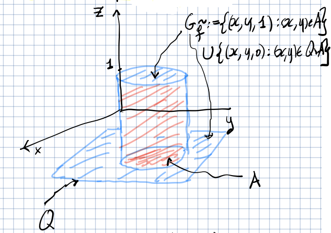
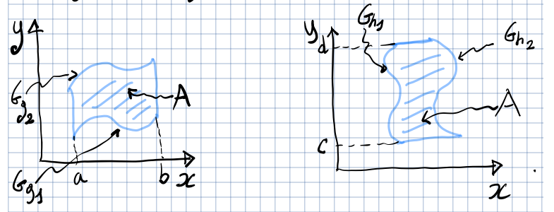

## Integrale doppio su insiemi generali

Sia $A \subseteq \R^{2}$ limitato e sia $f: A \to \R$ limitata, e sia
$Q = [a,b] \times [c,d] \supset A$. Definiamo $\tilde{f} \in \R(Q)$,
$\tilde{f}(x,y) = \begin{cases} (x,y) \in A \implies f(x,y) \\ (x,y) \in Q \setminus A \implies 0 \end{cases}$.

Si dice che $f$ è integrabile in $A$ ($f \in  R(A)$) se $\tilde{f} \in R(Q)$. In
questo caso $\iint_{A} f = \iint_{Q} \tilde{f}$.

Se per l'insieme $A$ non fosse definita una nozione di area, non sapremmo
calcolare $\iint_{A} f$.

### Insiemi misurabili e loro area

Un insieme $A$ si dice misurabile se $f \in R(A)$. In questo caso il valore
dell'integrale si chiama misura di $A$ e si denota con:

$$
|A|_{2} = \iint_{A} 1\ dx dy
$$

#### Teoremi

- Sia $A \subseteq \R^{2}$ limitato. Allora $A$ è misurabile se e solo se
  $\partial A$ è misurabile e $| \partial A |_{2} = 0$.
- Sia $g: [a,b] \to \R$ integrabile come funzione di 1 variabile. Allora
  $G_{g} = \Set{(x, g(x)) \mid x \in [a,b]}$ è misurabile e $|G_{g}|_{2} = 0$.

**Corollario**: Se la frontiera di $A$ è un insieme dato dall'unione dei grafici
di funzioni continue, allora $A$ è misurabile.

#### Misurabilità di insiemi semplici del piano

Siano $g_1, g_2: [a,b] \to \R$ continue e supponiamo che
$\forall\ x \in [a,b],\ g_1(x) \leq g_2(x)$. Sia
$A = \Set{(x,y) \in \R^2 \mid a \leq x \leq b,\ g_1(x) \leq y \leq g_2(x)}$
(insieme semplice rispetto all'asse $y$).

Per il corollario visto prima, $A$ è misurabile.

#### Esistenza dell'integrale doppio su insiemi misurabili

Sia $f: A \to \R$. Supponiamo che $A$ sia limitato e misurabile e che $f$ sia
limitata e $f \in C^{0}(A)$. Allora $f \in R(A)$.

:::tip

Per il teorema di Weierstrass, non serve provare che $f$ ciò è già garantito
dalle altre ipotesi di questo teorema.

:::

#### Integrale doppio su insieme di misura nulla

Sia $A \subseteq \R^{2}$ un insieme limitato e misurabile e sia $f \in R(A)$.
Inoltre supponiamo che $A = B \cup C$, con $B$ e $C$ misurabili e $|C|_{2} = 0$.
Allora $\iint_{A} f = \iint_{B} f$.

Da questo teorema deriva che:

$$
\iint_{A} f = \iint_{\dot{A}} f
$$

### Integrali doppi su domini semplici e formule di riduzione

- Un insieme $A \subseteq \R^{2}$ si dice dominio semplice (o normale) rispetto
  all'asse $y$ se esistono
  $g_{1}, g_{2} \in C^{0}([a,b]) \mid \forall\ x \in [a,b],\ g_{1}(x) \leq g_{2}(x)$
  e
  $A = \Set{(x,y) \in \R^{2} \mid x \in [a,b],\ g_{1}(x) \leq y \leq g_{2}(x)}$.

- Un insieme $A \subseteq \R^{2}$ si dice dominio semplice (o normale) rispetto
  all'asse $x$ se esistono
  $h_{1}, h_{2} \in C^{0}([c,d]) \mid \forall\ x \in [c,d],\ h_{1}(x) \leq h_{2}(x)$
  e
  $A = \Set{(x,y) \in \R^{2} \mid y \in [c,d],\ h_{1}(y) \leq x \leq h_{2}(y)}$.

Se un insieme è un dominio semplice, allora esso è limitato e misurabile. Quindi
se $A$ è semplice e $f \in C^{0}(A)$, allora $f \in R(A)$.

#### Formula di riduzione su domini semplici

- Se $A$ è semplice rispetto ad $y$, allora:

  $$
  \iint_{A} f = \int_{a}^{b} \left( \int_{g_{1}(x)}^{g_{2}(x)} f(x,y)\ dy \right)\ dx
  $$

  $A$ è misurabile e
  $|A|_{2} = \iint_{A} 1 = \int_{a}^{b} \left( g_{2}(x) - g_{1}(x) \right)\ dx$.

- Se $A$ è semplice rispetto ad $x$, allora:

  $$
  \iint_{A} f = \int_{c}^{d} \left( \int_{h_{1}(x)}^{h_{2}(x)} f(x,y)\ dx \right)\ dy
  $$

  $A$ è misurabile e
  $|A|_{2} = \iint_{A} 1 = \int_{c}^{d} \left( h_{2}(y) - h_{1}(y) \right)\ dy$.
