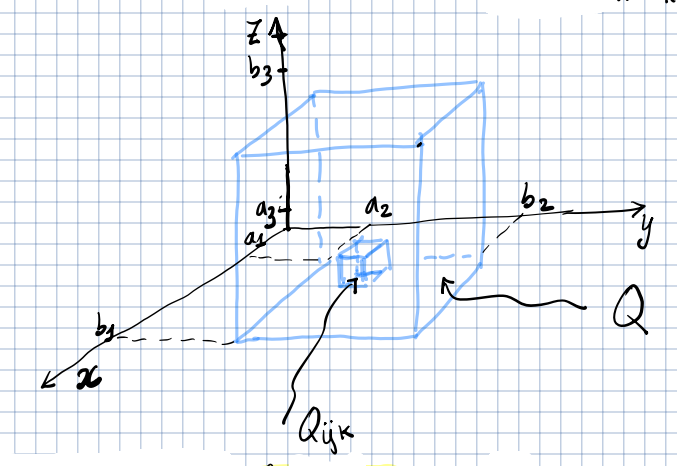

# Integrali tripli

## Integrale triplo su un parallelepipedo

Sia
$Q = [a_{1},b_{1}] \times [a_{2}, b_{2}] \times [a_{3}, b_{3}] \subset \R^{3}$
un parallelepipedo.

Per ciascun lato prendiamo una suddivisione:

- $D_{1} = \Set{a_{1} = x_{0} < \ldots < x_{i} < \ldots < x_{n_{1}} = b_{1} }$
- $D_{2} = \Set{a_{2} = y_{0} < \ldots < y_{i} < \ldots < x_{n_{2}} = b_{2} }$
- $D_{3} = \Set{a_{3} = z_{0} < \ldots < z_{i} < \ldots < x_{n_{3}} = b_{3} }$

Si chiama suddivisione del parallelepipedo $Q$ una suddivisione
$D = D_{1} \times D_{2} \times D_{3}$. Quindi $Q$ risulta diviso in
$n_{1}\ n_{2}\ n_{3}$ parallelepipedi.

$|Q_{ijk}|_{3}$ indica il volume di una suddivisione di $Q$.

Definiamo:

- $S(f,D) = \sum_{i,j,k} M_{ijk}\ |Q_{ijk}|_{3}$ somma superiore di $f$ su $Q$.
- $s(f,D) = \sum_{i,j,k} m_{ijk}\ |Q_{ijk}|_{3}$ somma inferiore di $f$ su $Q$.

Si dice che $f$ è integrabile secondo Riemann su $Q$ e si scrive $f \in R(Q)$
se:

$$
L \in \R = \sup_{D} s(f,D) = \inf_{D} S(f,D)
$$

Il valore di $L$ prende il nome di integrale triplo di $f$ su $Q$ e si denota
con:

$$
\iiint_{Q} f(x,y,z)\ dx\ dy\ dz
$$

Valgono gli stessi teoremi degli integrali doppi su rettangoli:

## Integrale triplo su insiemi generali

Stessa definizione degli integrali doppi. Prendo un parallelepipedo che
racchiude l'insieme e una funzione $\tilde{f}$ che vale come $f$ dentro
all'insieme e $0$ fuori.

### Insiemi misurabili

Come per $\R^{2}$, $A \subseteq \R^{3}$ è misurabile se:

- $A$ è misurabile;
- $\partial A$ è misurabile;
- $|\partial A|_{3} = 0$

# Cambio di variabile per integrali tripli

Siano $D, D' \in \R^{3}$ insiemi aperti, limitati e misurabili. Sia
$\psi: D' \to D$ un cambiamento di variabili e sia $f \in C^{0}(D)$ e limitata.
Allora:

$$
\iiint_{D} f(x,y,z)\ dx\ dy\ dz = \iiint_{D'} f(\psi(u,v,w))\ |det(D_{\psi}(u,v,w)|\ du\ dv\ dw
$$
