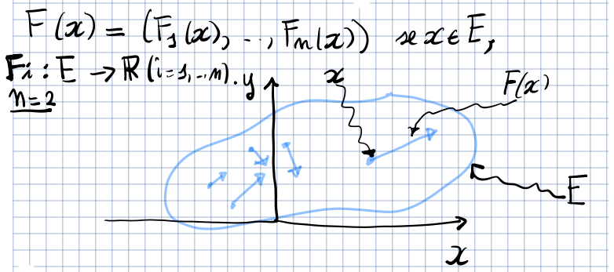

# Lunghezza di una curva

Sia $\gamma: [a,b] \to \R^{n}$ una curva e sia
$D = \Set{ a = t_{0} < t_{1} < \ldots < t_{N} = b }$ una suddivisione di
$[a,b]$. Di conseguenza anche il sostegno di $\gamma$ è suddiviso in $N + 1$
punti definiti da $\gamma(t_{0}), \ldots, \gamma(t_{N})$.

Consideriamo i segmenti $[\gamma(t_{i-1}), \gamma(t_{i})]$. La lunghezza
spezzata dell'unione $\cup_{i=1}^{N} [\gamma(t_{i-1}), \gamma(t_{i})]$ è data
da:

$$
L(\gamma, D) = \sum_{i=1}^{N} ||\gamma(t_{i-1}) - \gamma(t_{i})||
$$

Ora denotiamo:

$$
L(\gamma) = \sup_{D} L(\gamma, D)
$$

Se $L(\gamma) < \infty$, allora la curva si dice rettificabile e $L(\gamma)$ è
detta lunghezza di $\gamma$.

:::note

Si può provare che esistono curve (frattali) che hanno lunghezza infinita anche
se l'intervallo di partenza è limitato.

:::

## Teorema della lunghezza di una curva

Sia $\gamma: [a,b] \to \R^{n}$ una curva di classe $C^{1}$. Allora $\gamma$ è
rettificabile e:

$$
L(\gamma) = \int_{a}^{b} ||\gamma'(t)||\ dt = \int_{a}^{b} \sqrt{\gamma'_{1}(t) + \ldots + \gamma'_{n}(t)}\ dt
$$

## Lunghezza di curve piane cartesiane

Sia $\gamma: [a,b] \to \R^{2}$ una curva piana cartesiana di classe $C^{1}$,
ovvero:

$$
\gamma(t) = (t, f(t)) \lor \gamma(t) = (f(t), t), \text{ con } f \in C^{1}([a,b])
$$

Allora $\gamma$ è rettificabile e:

$$
L(\gamma) = \int_{a}^{b} \sqrt{1 + f'(t)^{2}}\ dt
$$

## Indipendenza della lunghezza dalla parametrizzazione

Siano $\gamma: [a,b] \to \R^{n}$ e $\tilde{\gamma}: [\alpha, \beta] \to \R^{n}$
2 curve di classe $C^{1}$ equivalenti. Allora:

$$
L(\gamma) = L(\tilde{\gamma})
$$

## Lunghezza di una curva $C^{1}$ a tratti

La lunghezza di una curva $C^{1}$ a tratti è data dalla somma delle lunghezze
dei vari segmenti che la compongono.

# Integrali curvilinei di I specie

Sia $\gamma: [a,b] \to \R^{n}$ una curva di classe $C^{1}$ e sia
$f: \gamma([a,b]) \to \R$ una funzione continua. SI definisce l'integrale
curvilineo di I specie di $f$ su $\gamma$ come:

$$
\int_{\gamma} f\ ds = \int_{a}^{b} f(\gamma(t))\ ||\gamma'(t)||\ dt
$$

Se $\gamma$ fosse una curva chiusa e semplice, allora si usa anche il simbolo:

$$
\oint_{\gamma} f\ ds
$$

- L'integrale curvilineo di I specie è lineare:
  $\int_{\gamma} \alpha\ f + \beta\ g\ ds = \alpha \int_{\gamma} f\ ds + \beta \int_{\gamma} g\ ds$
- L'integrale curvilineo di I specie si estende a curve $C^{1}$ a tratti.
  $\int_{\gamma} f\ ds = \sum_{i=1}^{N} \int_{\gamma_{\mid [t_{i-1},t_{i}]}} f\ ds$
- Il valore dell'integrale curvilineo non dipende dalla parametrizzazione della
  curva.

# Integrali curvilinei di II specie

## Campi vettoriali

Si chiama campo vettoriale su un insieme $E \subseteq \R^{n}$ una mappa
$F: E \to \R^{n}$, $F(x) = (F_{1}(x), \ldots, F_{n}(x))$.

In fisica, un campo vettoriale può rappresentare una forza applicata ad un punto
$x \in E$.

## Forma differenziale

Dato un campo vettoriale $F: E \subseteq \R^{n} \to \R^{n}$, si chiama forma
differenziale (lineare) su $E$ l'espressione formale:

$$
\omega = F_{1}\ dx_{1} + \ldots + F_{n}\ dx_{n} = \sum_{i=1}^{n} F_{i}\ dx_{i}
$$

che si scrive anche:

$$
\omega = \langle F, dx \rangle = F \cdot dx
$$

Dalla definizione si evince che ad ogni campo vettoriale corrisponde
biunivocamente una forma differenziale.

Una forma differenziale $\omega = \sum_{i=1}^{n} F_{i}\ dx_{i}$ su un insieme
$E \subseteq \R^{n}$ si dice di classe $C^{0}$ se
$\forall\ i \in 1,\ldots,n,\ F_{i} \in C_{0}(E)$

### Lavoro compiuto da una forza lungo un percorso

Sia $F: \R^{3} \to \R^{3}$ una forza
$F(x,y,z) = (F_{1}(x,y,z), F_{2}(x,y,z), F_{3}(x,y,z))$, $F \in C^{0}(\R^{3})$.

Sia $\gamma(t) = (\gamma_{1}(t), \gamma_{2}(t), \gamma_{3}(t))$ una curva di
classe $C^{1}$.

La forma differenziale $w = F \cdot dx$ rappresenta il lavoro compiuto dalla
forza $F$ su un punto materiale che si muove di uno spostamento infinitesimo
$(dx,dy,dz) = (\gamma'_{1}(t)\ dt, \gamma'_{2}(t)\ dt, \gamma'_{3}(t)\ dt)$
lungo la curva $\gamma$.

Il lavoro compiuto dalla forza nell'intervallo di tempo infinitesimo $dt$
sarebbe dato da:

$$
(F(\gamma(t)) \cdot \gamma'(t))\ dt
$$

## Definizione

Sia $\gamma: [a,b] \to E \subseteq \R^{n}$ una curva di classe $C^{1}$ e sia
$\omega = F \cdot dx$ una forma differenziale di classe $C^{0}$ su $E$.

Si definisce integrale curvilineo di II specie di $\omega$ lungo $\gamma$ il
valore:

$$
\int_{\gamma} \omega = \int_{a}^{b} F(\gamma(t))\ \gamma'(t)\ dt = \int_{a}^{b} \sum_{i=1}^{n} F_{i}(\gamma(t))\ \gamma'_{i}(t)\ dt
$$

Se $\gamma$ fosse chiusa si scrive anche:

$$
\oint_{\gamma} \omega
$$

- L'integrale curvilineo di II specie è lineare.
- L'integrale curvilineo di II specie si estende anche a curve $C^{1}$ a tratti.

## Campi vettoriali conservativi

Cosa vuol dire che $F$ è conservativo?

Per ogni curva $C^{1}$ a tratti, chiusa, $\gamma: [a,b] \to \R^{3}$:

$$
\oint_{\gamma} F \cdot dx = 0
$$

oppure:

- $F \in C^{0}$
- $\exists\ u \in C^{0}(\R^{3}),\ u: \R^{3} \to \R \mid \nabla u = - F$
