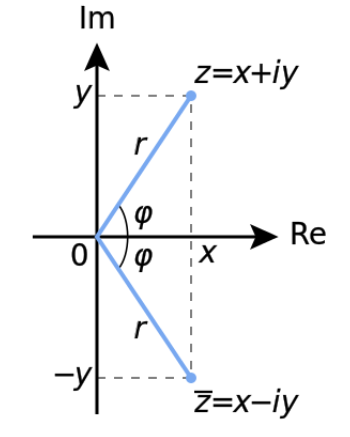
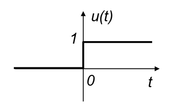
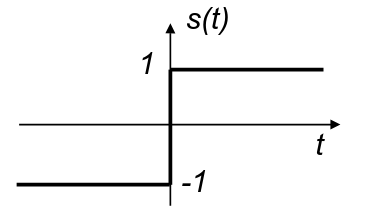
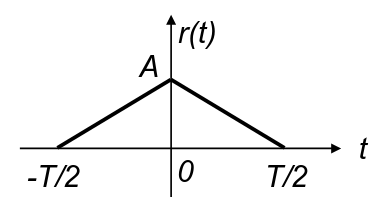
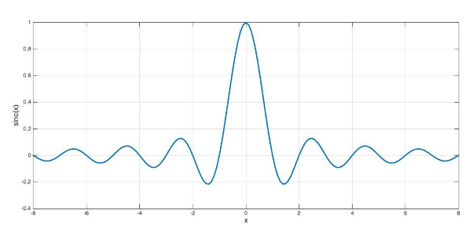
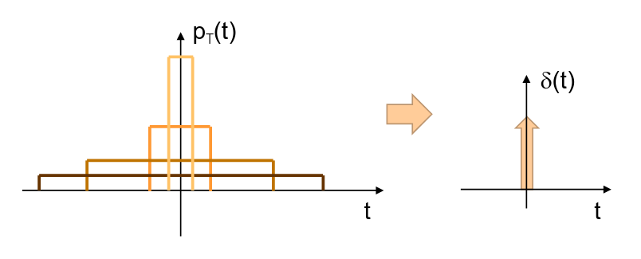

## Modellazione di un sistema

Modellare un sistema significa creare un modello matematico che spiega come il
sistema agisce su un segnale.

Dato che un modello ci permette di capire come ogni blocco modificherà il
segnale senza realizzarlo, si può usare per:

- progettare catene che abbiano una funzione scelta da noi;
- prevedere il funzionamento di un dato sistema;
- realizzare simulatori software;

### Modello matematico di un segnale

Il segnale è legato alla **variazione** di una grandezza fisica in un certo
dominio. Dal punto di vista matematico questo può essere espresso tramite una
funzione che restituisce i valori assunti dalla grandezza nel dominio.

In base al codominio:

- segnale scalare: per ogni punto del dominio, restituisce un unico valore reale
  (Esempio: audio);
- segnale vettoriale: per ogni punto del dominio, restituisce più valori
  (Esempio: immagine RGB);

In base al dominio:

- segnale mono-dimensionale: cambia solo rispetto una variabile (Esempio: un
  segnale che cambia nel tempo);
- segnale multi-dimensionale: cambia rispetto a più variabili (Esempio: un
  segnale che cambia in base alla posizione in cui si rileva);

## Parametri usati per classificare un segnale

### Dominio

- segnali a dominio continuo: possono essere misurati in ogni punto del dominio,
  che è quindi una variabile reale;
- segnali a dominio discreto: possono essere misurati solo in un insieme di
  punti predefiniti;

### Ampiezza

- segnali ad ampiezza continua: possono assumere con continuità tutti i valori
  reali in un certo intervallo;
- segnali ad ampiezza discreta: possono assumere valori compresi in un insieme
  numerabile;

:::note

In base a dominio ed ampiezza sono definite 4 categorie di segnali:

- analogici: dominio e ampiezza continui;
- campionati: dominio discreto e ampiezza continua;
- quantizzati: dominio continuo e ampiezza discreta;
- digitali: dominio e ampiezza discreti;

:::

In natura i segnali hanno prevalentemente forma analogica, la loro controparte
digitale viene solitamente ottenuta tramite elaborazioni artificiali.

### Periodicità

- segnali periodici: si ripetono uguali a se stessi ad ogni intervallo di tempo
  prefissato, detto periodo;
  - la ripetizione continua all'infinito;
  - matematicamente: $x(t + kT) = x(t)$, dove $T$ è il periodo;
- segnali aperiodici: segnali che non sempre si ripetono;

### Natura deterministica o aleatoria

- segnali deterministici: il valore del segnale è univocamente definito una
  volta fissate le variabili di dominio. Un segnale è deterministico quando esso
  corrisponde ad una funzione analitica nota, oppure è una registrazione di un
  segnale aleatorio.
- segnali aleatori: non è possibile conoscere con esattezza a priori il valore
  assunto dal segnale in un certo istante.

In questo corso ci concentreremo solo sui segnali deterministici.

## Numeri complessi

- $z = x + i y \in \mathbb{C}$
- $r = |z| = \sqrt{x^2 + y^2} \in \R$
- $\phi = arg(z) = arctan(\frac{y}{x}) \in \R$

Formule di Eulero:

- $\cos(\phi) = \frac{e^{i \phi} + e^{- i \phi}}{2}$
- $\sin(\phi) = \frac{e^{i \phi} - e^{- i \phi}}{2}$
- $e^{i \phi} = \cos(\phi) + i \sin(\phi)$
- $z = r e^{i \phi}$

### Funzioni complesse

Una funzione complessa è una funzione di variabile reale o complessa che
restituisce valori complessi.

## Proprietà dei segnali

### Simmetria

Una funzione ha simmetria nel dominio $D$:

- pari, se $x(t) = x(-t)\ \forall\ t \in D$ (funzione simmetrica rispetto
  all'asse y);
- dispari, se $x(-t) = -x(t)\ \forall\ t \in D$ (funzione simmetrica rispetto
  alla retta $y = x$);

Altrimenti la funzione non ha proprietà di simmetria.

### Causalità

Un segnale $x(t)$ si dice causale se è nullo prima di un dato istante $t_0$.

Questo significa che nell'istante $t_0$ si verifica un evento che produce
$x(t)$.

Per il principio di cause-effetto, il segnale non può esistere prima
dell'instante $t_0$.

La funzione gradino unitario ha valore $0$ prima di $t_0$ e $1$ dopo. Qualsiasi
segnale causale può essere rappresentato come il prodotto tra una funzione e il
gradino unitario.

## Funzioni notevoli

### Rettangolo simmetrico

$$
A \Pi (\frac{t}{T}) = \begin{cases} |t| \leq \frac{T}{2} \implies A \\ \text{altrove} \implies 0 \end{cases}
$$

L'argomento non rappresenta una frazione. $A$ rappresenta l'altezza (ampiezza)
del rettangolo, $T$ rappresenta la larghezza (durata).

### Funzione gradino unitario

$$
u(t) = 1(t) = \begin{cases} t \geq 0 \implies 1 \\ \text{altrove} \implies 0 \end{cases}
$$

### Funzione segno

$$
s(t) = \begin{cases} t > 0 \implies 1 \\ t < 0 \implies -1 \end{cases}
$$

### Triangolo simmetrico

$$
A \Lambda (\frac{t}{T}) = \begin{cases} |t| \leq \frac{T}{2} \implies \frac{A(\frac{T}{2} - |t|)}{\frac{T}{2}} \\ \text{altrove} \implies 0 \end{cases}
$$

Triangolo di altezza $t$ e base $T$.

### Funzione $\text{sinc}$

$$
\text{sinc}(x) = \frac{\sin(\pi x)}{\pi x}
$$

## Funzioni generalizzate

### Funzione impulso unitario (o delta di Dirac)

È una funzione definita unicamente sulla base delle sue proprietà (integrali).

Chiamiamo impulso unitario la funzione $\delta(t)$ che, data una generica
funzione di test $f(t)$, continua ed integrabile, soddisfa la seguente
uguaglianza:

$$
\int_{- \infty}^{+ \infty} f(t) \delta(t) dt = f(0)
$$

Possiamo ottenere una funzione che soddisfi questa proprietà partendo da un
rettangolo di area unitaria e durata T. Portando al limite $T \to 0$ si ottiene:

$$
\delta(t) = \lim_{T \to 0} \frac{1}{t} \Pi \left(\frac{t}{T}\right) = \begin{cases} t = 0 \implies + \infty \\ \text{altrove} \implies 0 \end{cases}
$$

