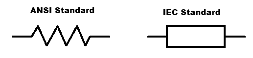

## Circuiti a parametri concentrati

Quando si parla di circuiti si possono considerare 2 macro-modelli:

- circuiti a parametri concentrati:
  - rappresentazione ideale, non rappresenta perfettamente la realtà;
  - l'effetto di ogni componente sul circuito è ridotto al ruolo dato dalla sua
    definizione (ad esempio una resistenza darà solo R, non verranno considerate
    le sue altre caratteristiche come per esempio induttanza e capacità
    intrinseche);
- circuiti a parametri distribuiti:
  - usati soprattutto per reti di distribuzioni;
  - sono una rappresentazione più realistica;

Nel corso tratteremo solo circuiti a parametri concentrati.

## Ripasso

### Topologia

Introduciamo un elemento generico con 2 morsetti. Attraverso i morsetti,
l'oggetto si collega agli altri del circuito.

Il collegamento che si forma unendo più elementi viene detto topologia. A noi
non interesseranno le caratteristiche del collegamento (curvatura, lunghezza,
...), solo gli elementi del circuito avranno rilevanza.

Preso un elemento con una differenza di potenziale tra i morsetti, allora
sappiamo che c'è una corrente che scorre attraverso esso. In fisica, per
convenzione, la corrente scorre dal polo positivo a quello negativo
dell'elemento.

Un **nodo** è definito come la connessione tra 2 o più elementi. Una **maglia**
è definita come il percorso che posso fare su un circuito.

```
                               ┌───┐
                             ┌─┤   ├─┐
  ┌───┐   ┌───┐        ┌───┐ │ └───┘ │
┌─┤   ├───┤   ├─┐    ┌─┤   ├─┤       │
│ └───┘   └───┘ │    │ └───┘ │ ┌───┐ │
└───────────────┘    │       └─┤   ├─┤
                     │         └───┘ │
                     └───────────────┘
```

Nei circuiti sopra ci sono sempre 2 nodi, però nel primo c'è solo una maglia,
mentre nel secondo 3.

### Leggi di Kirchhoff

#### Legge dei nodi (Kirchhoff Current Law)

**La somma delle correnti che entrano ed escono in un nodo è sempre uguale a
0**.

$$
\sum_{i = 1}^n I_i(t) = 0
$$

**Convenzione**: se la corrente è entrante nel nodo il suo segno sarà positivo,
se invece è uscente sarà negativo.

**Convenzione**: la corrente scorre dai punti con potenziale più alto a quelli
con potenziale più basso.

#### Legge delle maglie (Kirchhoff Voltage Law)

Preso un verso di percorrenza della maglia (tipicamente in senso orario), **la
somma delle differenze di potenziale lungo il percorso sarà sempre uguale a 0**.

$$
\sum_{i = 1}^n V_i(t) = 0
$$

**Convenzione**: entrare nel componente dal morsetto positivo e uscire da quello
negativo genera una differenza di potenziale con segno positivo. Viceversa se il
componente è attraversato nell'altro verso.

## Componenti circuitali

I componenti che studieremo in questo corso saranno sempre:

- passivi (eccetto i generatori): non generano energia, possono solo dissiparla
  o immagazinarla;
- lineari;
- tempo-invarianti;

## Resistore

$$
V(t) = f(I(t))
$$

Simbolo:



Restrizioni:

- linearità: $V(t) = R(t)\ I(t)$;
- tempo-invarianza: $V(t) = R\ I(t)$;

Da queste definizioni segue che corrente e tensione devono essere sempre o
entrambe positive o entrambe negative (la resistenza è sempre positiva).

Per una rappresentazione grafica, su usa un grafico a 2 assi ($I$ verticale e
$V$ orizzontale). Il diagramma di un resistore è sempre una retta passante per
il primo o terzo quadrante.

## Generatori di tensione e corrente

Un **generatore di tensione** è un oggetto che **mantiene una differenza di
potenziale** ai suoi capi. Il suo grafico $I$/$V$ è una retta verticale che
passa per la $V$ del generatore.

Un **generatore di corrente** è un oggetto che **mantiene una corrente** in
uscita. Il suo grafico $I$/$V$ è una retta orizzontale che passa per la $I$ del
generatore.

Il generatore ideale è in grado di mantenere la stessa tensione per ogni
corrente.

Consideriamo la relazione tra corrente e tensione in un resistore. Il
comportamento di un generatore di tensione spento può essere simulato portando
la resistenza a 0, e quindi $\frac{1}{R} = +\infty$. Questo significa che un
generatore di tensione con $V = 0$ è equivalente ad un resistore con $R = 0$,
ovvero un cortocircuito.

Eseguendo l'operazione contraria, ovvero portando la resistenza a $+\infty$, si
può simulare un generatore di corrente spento. Questo dimostra che un generatore
di corrente con $I = 0$ è equivalente ad un resistore con $R = +\infty$ e quindi
ad un circuito aperto.

## Partitore di tensione

Prendo un generatore di tensione ($V$) collegato in serie a 2 resistenze $R_1$ e
$R_2$. Voglio sapere qual'è la tensione nel nodo ($o_1$) tra $R_1$ e $R_2$.

```
┌───┐
│+  R_1
V   ├────o_1
│-  R_2
└───┘
```

Dato che c'è solo una maglia, la corrente sarà uguale in tutti i punti. Inoltre
so che $V = V_{R_1} + V_{R_2} = I (R_1 + R_2)$:

Se risolvo il sistema trovo che:

$$
V_{R_1} = V \frac{R_2}{R_1 + R_2}
$$

Questa formula è detta partitore di tensione.

Questo metodo diventa complesso quando ci sono più resistori e generatori.

### Teorema di Thevenin

Per calcolare la differenza di potenziale tra $o_1$ e $o_2$, data da un circuito
composto da un certo numero di generatori e resistori, è sempre possibile
trovare una rappresentazione data da un generatore di tensione equivalente
($V_t$) e un resistore equivalente ($R_t$) collegati in serie.

```
┌───R_1───┬────o_1       ┌──R_t──o_1
│+        │              │+
V_1       R_2       ─>  V_t
│-        │              │-
└─────────┴────o_2       └───────o_2
      <── I                 <── I
```

Questo si può fare perchè resistenze e generatori sono lineari. Quindi basta
fare manipolazioni algebriche.

Passaggi:

1. Determiniamo la $R_t$, per fare ciò spegnamo il generatore di tensione (e
   quindi lo sostituiamo con un cortocircuito).

   Ottieniamo così un circuito con 2 resistori in parallelo:

   ```
   ┌────┬────o_1
   │    │
   R_1  R_2
   │    │
   └────┴────o_2
   ```

   Quindi in questo caso $R_t = \frac{1}{\frac{1}{R_1} + \frac{1}{R_2}}$.

2. Si determina la differenza di potenziale equivalente $V_t$ (partitore di
   tensione tra $R_1$ e $R_2$). Questa è la parte complicata, ma vedremo poi che
   si può escludere.

3. Si determina la corrente equivalente $I_t$, cortocircuitando il circuito tra
   $o_1$ e $o_2$.

   ```
   ┌────R_1──┬────o_1
   │+        │    │
   V_1       R_2  │
   │-        │    │
   └─────────┴────o_2
         <── I
   ```

   In questo caso $I_t = \frac{V_1}{R_1}$.

Dato che vale sempre la legge di Ohm ($V_t = R_t\ I_t$), mi trovo con 2 modi per
calcolare $V_t$. Questo vuol dire che posso escludere i calcoli del punto 2 che
tendono a diventare i più complicati.

### Teorema di Norton

Dato un circuito circuito composto da resistori e generatori, lo posso sempre
scrivere come un generatore di corrente in parallelo ad un resistore
equivalente.

```
┌────┬────o_1
│    │
I_n  R_n
│    │
└────┴────o_2
```
