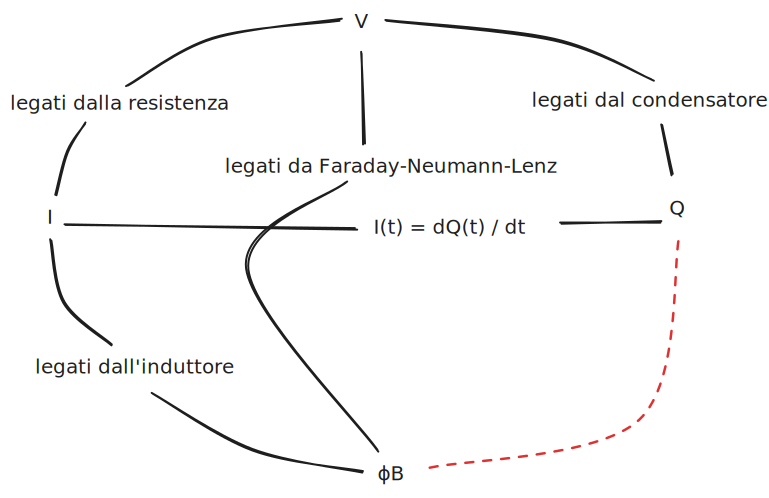

## Potenza ed energia elettrica

Se colleghiamo un generatore a un bipolo, avremo una corrente e una differenza
di potenziale.

Definiamo la potenza dissipata dal circuito come:

$$
P(t) = I(t)\ V(t)
$$

Possiamo creare un grafico con $I(t)$ sull'asse verticale e $V(t)$
sull'orizzontale. Il grafico della funzione potenza sarà sempre nel 1° o 3°
quadrante, dato che corrente e tensione sono sempre o entrambi positivi o
entrambi negativi.

L'energia immagazzinata da un circuito elettrico si può esprimere come la
potenza utilizzata per un certo periodo di tempo:

$$
E(t_1, t_2) = \int_{t_1}^{t_2} P(t)\ dt = \int_{t_1}^{t_2} I(t)\ V(t)\ dt
$$

Per il condensatore:

$$
E(t_1, t_2) = C \int_{t_1}^{t_2} \frac{d V(t)}{dt}\ V(t)\ dt = C \int_{V(t_1)}^{V(t_2)} V(t)\ dV(t) = \left[C \frac{1}{2} (V(t))^{2}\right]_{V(t_1)}^{V(t_2)}
$$

Per l'induttore:

$$
E(t_1, t_2) = L \int_{t_1}^{t_2} I(t)\ \frac{d I(t)}{dt}\ dt = L \int_{I(t_1)}^{I(t_2)} I(t)\ dI(t) = \left[L \frac{1}{2} (I(t))^{2}\right]_{V(t_1)}^{V(t_2)}
$$

## Legame tra le grandezze elettromagnetiche



## Elementi in serie e in parallelo

### Resistori in serie

Prendiamo $n$ resistori in serie $R_1, \ldots, R_n$.

La differenza di potenziale è data dalla somma di tutte le differenze di
potenziale dei singoli resistori. La corrente passante è la stessa per ogni
resistore.

$$
V_{\text{tot}}(t) = \sum_{i=1}^n V_{R_i}(t)
$$

$$
R_{\text{tot}}(t) = \frac{V_{\text{tot}(t)}}{I(t)} = \sum_{i=1}^n R_i(t)
$$

### Resistori in parallelo

Prendiamo $n$ resistori in parallelo $R_1, \ldots, R_n$.

Ogni resistore avrà la stessa differenza di potenziale ai suoi capi. Ciò che
cambia è la corrente che passa attraverso ciascuna maglia.

$$
I_{\text{tot}} = \sum_{i=1}^n = \sum_{i=1}^n \frac{V(t)}{R_i}
$$

$$
\frac{1}{R_{\text{tot}}} = \frac{I_{\text{tot}}}{V(t)} = \sum_{i=1}^n \frac{1}{R_i}
$$

### Condensatori in serie

Prendiamo $n$ condensatori in serie $C_1, \ldots, C_n$.

La carica sulle armature è la stessa per tutti i condensatori, mentre la
differenza di potenziale totale sarà:

$$
V_{\text{tot}}(t) = \sum_{i=1}^{n} V_i(t) = \sum_{i=1}^n \frac{Q(t)}{C_i}
$$

$$
\frac{1}{C_{\text{tot}}} = \sum_{i=1}^n \frac{V_{\text{tot}}(t)}{Q(t)} = \sum_{i=1}^n \frac{1}{C_i}
$$

### Condensatori in parallelo

Prendiamo $n$ condensatori in parallelo $C_1, \ldots, C_n$.

La carica totale si distribuisce in maniera non uniforme sulle armature. Mentre
la differenza di potenziale è uguale per tutte.

$$
Q_{\text{tot}}(t) = \sum_{i=1}^n Q_i(t) = \sum_{i=1}^n C_i V(t)
$$

$$
C_{\text{tot}} = \sum_{i=1}^n \frac{Q_{\text{tot}}(t)}{V(t)} = \sum_{i=1}^n C_i
$$

### Induttori in serie

Prendiamo $n$ induttori in serie $L_1, \ldots, L_n$.

L'induttanza, come la resistenza, è proporzionale alla lunghezza. In questo caso
l'induttore ha lo stesso comportamento del resistore e quindi:

$$
L_{\text{tot}} = \sum_{i=1}^n L_i
$$

### Induttori in parallelo

Prendiamo $n$ induttori in parallelo $L_1, \ldots, L_n$.

La corrente si distribuisce su ogni maglia. La differenza di potenziale è la
stessa per tutti gli induttori.

$$
I_{\text{tot}}(t) = \sum_{i=1}^n I_i(t) = \sum_{i=1}^n \frac{1}{L_i} \int_0^t V(t)\ dt = \int_0^t V(t)\ dt\ \sum_{i=1}^n \frac{1}{L_i}
$$

$$
\frac{1}{L_{\text{tot}}} = \frac{I_{\text{tot}}(t)}{\int_0^t V(t)\ dt} = \sum_{i=1}^n \frac{1}{L}
$$

## Circuiti RC

Prendiamo un circuito formato da un generatore di tensione $V$, una resistenza
$R_1$ e poi in parallelo un capacitore $C$ e un'altra resistenza $R_2$.

Sopra $C$ c'è un interruttore che permette di collegare o staccare il
generatore, quindi definiamo la fase di carica quando l'interruttore è in
posizione $a$ e scarica quando è in posizione $b$.

```
# carica
┌──R_1─a\ b┐       ┌──R_1──┐
│+      │  │       │+      │
V       C  R  ──>  V       C
│-      │  │       │-      │
└───────┴──┘       └───────┘

# scarica
┌──R_1─a /b─┐       ┌────┐
│+       │  │       │+   │
V        C  R  -->  C    R_2
│-       │  │       │-   │
└────────┴──┘       └────┘
```

In entrambi i casi la corrente scorre in senso orario.

### Fase di scarica

Costruiamo un sistema:

$$
\begin{dcases}
-I_{R_2}(t) - I_C(t) = 0 \\
-V_C(t) + V_{R_2}(t) = 0 \\
V_{R_2}(t) = R_2\ I_{R_2}(t) \\
I_C(t) = C \frac{dV_C(t)}{dt} \\
V_C(t_0) = V_{\text{generatore}}
\end{dcases}
$$

Semplificando, otteniamo un problema di Cauchy:

$$
\begin{dcases}
C \frac{dV_C(t)}{dt} = - \frac{V_C(t)}{R_2} \\
V_C(t_0) = V_{\text{generatore}}
\end{dcases}
$$

Definiamo la **costante di tempo** $\tau = C\ R_2$. Rappresenta il tempo
necessario a raggiungere il 63,2% della tensione massima ai capi del
condensatore o il tempo necessario perchè essa scenda al 38.6% del valore
massimo.

$$
\begin{dcases}
\frac{dV_C(t)}{dt} = - \frac{V_C(t)}{\tau} \iff \int_{V_C(t_0)}^{V_C(t)} \frac{dV_C(t)}{V_C(t)} = - \frac{1}{\tau} \int_{t_0}^t dt \\
V_C(t_0) = V_{\text{generatore}}
\end{dcases}
$$

$$
\begin{dcases}
\left[\ln(V_C(t))\right]_{V_C(t_0)}^{V_C(t)} = - \frac{t}{\tau} \\
V_C(t_0) = V_{\text{generatore}}
\end{dcases}
$$

Abbiamo trovato la funzione che da la differenza di potenziale in base al tempo
durante la scarica del circuito:

$$
\ln(V_C(t)) = \ln(V_{\text{generatore}}) - \frac{t}{\tau} \iff V_C(t) = V_{\text{generatore}}\ e^{- \frac{t}{\tau}}
$$

### Fase di carica

Costruiamo un sistema:

$$
\begin{dcases}
I_{R_1}(t) - I_C(t) = 0 \\
-V_{\text{generatore}} + V_{R_1}(t) + V_C(t) = 0 \\
V_{R_1}(t) = R_1\ I_{R_1}(t) \\
I_C(t) = C \frac{dV_C(t)}{dt} \\
V_C(t_0) = 0
\end{dcases}
$$

Semplificando, otteniamo un altro problema di Cauchy:

$$
\begin{dcases}
C \frac{dV_C(t)}{dt} = \frac{V_{\text{generatore}} - V_C(t)}{R_1} \\
V_C(t_0) = 0
\end{dcases}
$$

Questa volta $\tau = C\ R_1$.

$$
\begin{dcases}
\frac{dV_C(t)}{dt} = \frac{V_{\text{generatore}} - V_C(t)}{\tau} \iff \int_{V_C(t_0)}^{V_C(t)} \frac{dV_C(t)}{V_{\text{generatore}} - V_C(t)} = \frac{1}{\tau} \int_{t_0}^t dt \\
V_C(t_0) = 0
\end{dcases}
$$

$$
\begin{dcases}
\left[- \ln(V_{\text{generatore}} - V_C(t))\right]_{V_C(t_0)}^{V_C(t)} = \frac{t}{\tau} \\
V_C(t_0) = 0
\end{dcases}
$$

E ora abbiamo trovato la funzione che da la differenza di potenziale in base al
tempo durante la carica del circuito:

$$
\ln(V_{\text{generatore}} - V_C(t)) - \ln(V_{\text{generatore}} - V_C(t_0)) = - \frac{t}{\tau} \iff V_C(t) = V_{\text{generatore}} (1 - e^{- \frac{t}{\tau}})
$$

Alcuni punti interessanti:

- $V_C(\tau) = v_{\text{generatore}} (1 - \frac{1}{e})$
- $V_C(4 \tau) = v_{\text{generatore}} (1 - \frac{4}{e})$: vicino al 98% della
  tensione massima.
