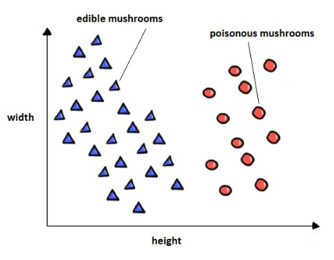

## Probabilità

Cosa distingue la scienza dagli altri? La scienza ha un metodo che si può usare
per dimostrare che alcune osservazioni sono false. Non da risposte certe, ma
risposte che sono verificabili da un gran numero di persone.

L'esito di un esperimento dipende sempre da molti fattori, quindi possiamo dire
che nei risultati c'è una componente casuale che non si può ignorare del tutto.

- Ho una tesi: una moneta è bilanciata.
- Ho una misura: 3 teste, 7 croci in 10 lanci.

Il P-value è la probabilità che assumendo la tesi sia vera, io possa ottenere
quel risultato.

Un esperimento è statisticamente significativo se è poco probabile che esso sia
capitato per caso.

Causa $\neq$ correlazione, anche se dei dati sembrano avere un andamento simile,
non si può direttamente affermare che uno causi l'altro.

## Lazy learning

Esempio: riconoscimento di cifre scritte a mano.

Si parte da un database KV, dove le chiavi sono l'immagine di una cifra e i
valori sono il numero corrispondente.

Questo database viene creato a mano da umani. Si definisce **apprendimento
supervisionato** perchè ci vuole qualcuno che verifichi la correttezza del
database.

Metodo più semplice: ricevuta un immagine la cerco nel database e do il
risultato:

- non è generale: se un'immagine è nuova il sistema non funziona;
- a noi serve un metodo che sia in grado di riconoscere anche nuove immagini;

## Nearest neighbors method

Questo diagramma mostra la distribuzione di funghi edibili e velenosi in base
alle dimensioni:

Quando osservo un nuovo fungo posso definire se è edibile o no copiando il
valore del fungo con dimensioni più vicine.

Nonostante la semplicità il metodo nearest neighbors è usabile quando:

- ho un database molto grande di casi etichettati;
- è ben definita una misura di distanza tra gli elementi;

### Perchè neighbors e non neighbor?

Nel database sopra, le 2 categorie di funghi sono ben distinte. Nella realtà è
possibile che ci sia un maggiore mescolamento tra i casi.

Di solito si parla di $k$ nearest neighbors perchè presi i $k$ elementi più
vicini, si sceglie il valore che appare più volte.
