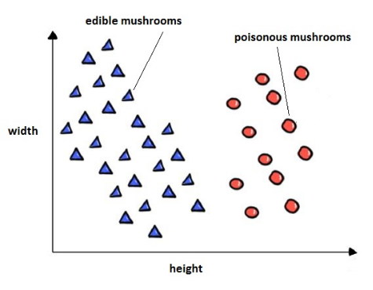

## Lazy learning

**Esempio**: riconoscimento di cifre scritte a mano.

Si parte da un database KV, dove le chiavi sono l'immagine di una cifra e i
valori sono il numero corrispondente. Si definisce **apprendimento
supervisionato** perchè ci vuole un supervisore (un umano o anche una macchina)
che crea il database.

Metodo non generale: ricevuta un immagine la cerco nel database e do il
risultato. Se un'immagine è nuova il sistema non funziona, a noi serve un metodo
che sia in grado di riconoscere anche nuove immagini.

## Nearest neighbors method

Questo diagramma mostra la distribuzione di funghi edibili e velenosi in base
alle dimensioni:

Quando osservo un nuovo fungo posso definire se è edibile o no copiando il
valore del fungo con dimensioni più vicine.

Nonostante la semplicità il metodo nearest neighbors è accettabile quando:

- ho un database molto grande di casi etichettati;
- è ben definita una misura di distanza tra gli elementi;

### Perchè neighbors e non neighbor?

Nel database sopra, le 2 categorie di funghi sono ben distinte. Nella realtà è
possibile che ci sia un maggiore mescolamento tra i casi.

Di solito si parla di $k$ nearest neighbors perchè presi i $k$ elementi più
vicini, si sceglie il valore che (per esempio) appare più volte.
