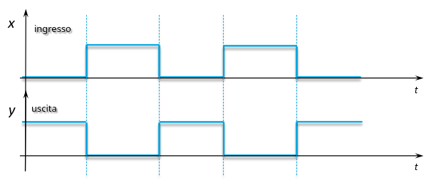
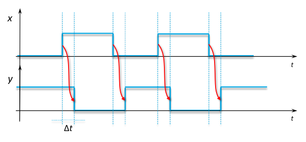

## Indifferenze e don't cares

In certe occasioni, il valore dell'uscita in corrispondenza di certe
combinazioni di ingressi non è rilevante.

Le combinazioni di ingresso per cui non si indica un valore preciso dell'uscita
sono dette indifferenze o don't cares.

La mappa di Karnaugh deve comunque assegnare un valore alla cella, quindi si
sceglie il valore che permette di ottenere l'espressione più semplice. Bisogna
però ricordarsi di non considerare essenziali gli implicanti che coprono gli 1
di un'indifferenza.

## Mappe a 5 variabili

Anche usando il codice Gray, è impossibile mantenere le vicinanze geometriche
sul piano.

Si possono usare 2 tabelle da 4 variabili dove in una si considerano gli output
con la quinta variabile a 0 e nell'altra con la variabile a 1 (espansione di
Shannon).

Sovrapponendo le 2 tabelle, si considerano vicine anche le celle che sono una
sopra l'altra.

## Prestazioni del circuito

Come già detto in precedenza, una porta logica richiede tempo prima che la sua
uscita sia stabile.

A noi interessa rappresentare il comportamento del circuito durante la fase
transitoria.

### Diagramma temporale

È un grafico con più assi orizzontali, uno per ogni ingresso e uno per ogni
uscita.

- esempio invertitore senza ritardi:

  

- esempio con ritardi:

  
